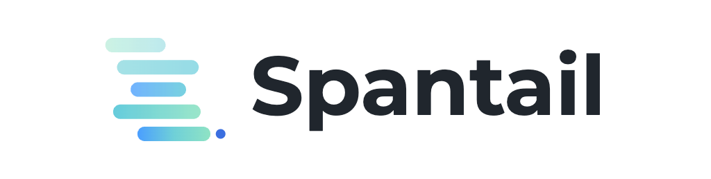

<p align="center">
  
</p>

> Understand how you and your AI agents actually work.

Spantail is an open-source platform for recording human and AI work with as little overhead as
possible — ideally none — then sharing and reviewing it in seconds. Built for the era of
human–AI collaboration: humans log work in a few keystrokes, AI coding agents stream their own
sessions in automatically, and the unified timeline becomes any report you need — daily, weekly,
monthly — from a single source of truth. Built AI-first: every operation is available to humans
(web, CLI) and AI agents (MCP) through the same API.

> **Status**: Early development. APIs and schemas are unstable. Not yet ready for production use.

## Features

- **Low-overhead capture** — work entries are a date, duration, description, and tags, with optional start/end times — built for fast daily logging. AI coding-agent work is captured automatically, with no manual entry.
- **AI agent sessions** — register an AI coding agent and its sessions stream in automatically: per-session duration and token usage land on the same timeline as human work. A reference [Claude Code](https://code.claude.com) Stop hook ([`hooks/claude-code`](hooks/claude-code)) posts per-turn token usage while conversation bodies stay on your machine.
- **Workspaces** — organize work by department, team, or client organization. Projects live under workspaces. One deployment serves one company; this is not a multi-tenant SaaS.
- **Unified reports** — no hardcoded report types. A report is a Markdown + Liquid template applied to filters you choose freely: any combination of workspaces, projects, users, and date range — including across workspaces. Built-in templates cover daily, weekly, and monthly reports.
- **Safe report sharing** — share an immutable report snapshot via an expiring, revocable link with an optional passcode. Viewers don't need an account — share with clients, stakeholders, or anyone outside your instance.
- **Collaborate on reports** — discuss a shared report inline with Markdown comments and GitHub-style emoji reactions, keeping the conversation next to the report instead of in email.
- **Keyboard-first** — operate fast without leaving the keyboard: `c` to quick-create an entry or report, `j`/`k` to move through lists, `o` to open the selected item.
- **AI-first API** — a built-in MCP server (remote Streamable HTTP, or local stdio via the CLI) and a CLI let AI agents and scripts log work and pull reports through the same REST API the web UI uses.
- **English / Japanese** — fully localized UI and documentation.

## Architecture

Spantail runs entirely on Cloudflare:

- **Workers** — a single Worker serves the REST API (`/api/v1`), the MCP endpoint (`/mcp`), shared report views, and the SPA static assets
- **D1** — primary database

Backend is [Hono](https://hono.dev) with [Drizzle](https://orm.drizzle.team) and [Better Auth](https://better-auth.com). Frontend is a React SPA built with Vite, TanStack Router/Query, and shadcn/ui.

See [`docs/data-model.md`](docs/data-model.md) for the data model — the resources Spantail stores and how they relate.
See [`docs/permissions.md`](docs/permissions.md) for the role-based permissions and resource visibility model.
See [`docs/security.md`](docs/security.md) for the security threat model — the Spantail-specific security properties and standing threats.

## Monorepo

| Path | Description |
|---|---|
| `apps/web` | Main application (Worker: API + MCP + SPA) |
| `apps/docs` | Documentation site (Astro Starlight, en/ja) |
| `packages/core` | Domain logic, Zod schemas, report engine |
| `packages/db` | Drizzle schema, migrations, queries |
| `packages/sdk` | Typed API client |
| `packages/cli` | `spantail` CLI (includes `spantail mcp` stdio server) |
| `hooks/claude-code` | Reference Claude Code Stop hook that records agent token usage |

## Getting started

Prerequisites: Node.js 24+, pnpm 10+, a Cloudflare account, and `wrangler` v4.

```bash
git clone https://github.com/spantail/spantail.git
cd spantail
pnpm install

# create local env vars
cp apps/web/.dev.vars.example apps/web/.dev.vars

# apply migrations to the local D1 emulator and start the dev server
pnpm db:migrate:local
pnpm dev
```

`pnpm dev` runs the SPA and the Worker together on the Cloudflare Vite plugin, with local emulation of D1.

## Self-hosting

Spantail is designed to be deployed to your own Cloudflare account:

```bash
wrangler d1 create spantail-db
# set the generated database ID in apps/web/wrangler.jsonc, then:
pnpm db:migrate:remote

# set the required session-signing secret (>= 32 chars); without it the worker
# fails closed — any request that touches auth/session code errors out, so
# sessions can never be signed with an empty value:
wrangler secret put BETTER_AUTH_SECRET   # paste e.g. `openssl rand -base64 32`

pnpm deploy
```

See the documentation at [spantail.com](https://spantail.com) for the full self-hosting guide, including required secrets and cost notes.

## CLI & MCP

```bash
spantail auth login                                  # store an API token
spantail log "Implemented report engine" --project core --duration 2h
spantail entries list --from 2026-06-01
spantail report run monthly --workspace acme --month 2026-06
spantail mcp                                         # stdio MCP server for AI clients
```

AI clients that support remote MCP can connect directly to `https://your-instance/mcp` with an API token.

To record an AI coding agent's sessions, register an agent in Spantail and wire its transcript to
the API — see the reference Stop hook in [`hooks/claude-code`](hooks/claude-code).

## Development

```bash
pnpm dev          # dev server (SPA + Worker + local D1)
pnpm test         # vitest (Workers pool)
pnpm lint         # biome
pnpm typecheck    # tsc across all packages
```

See [CLAUDE.md](./CLAUDE.md) for repository conventions.

## License

[MIT](./LICENSE)
