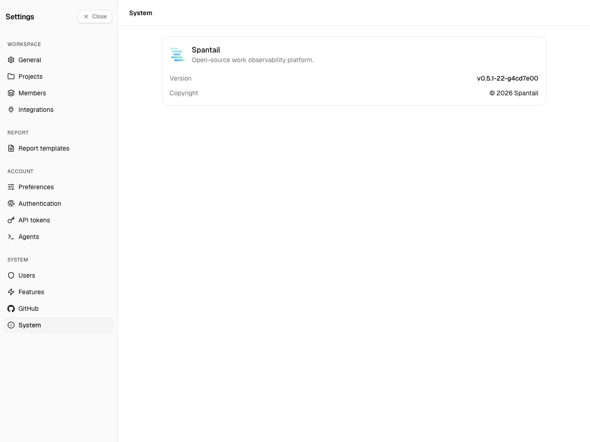

The **System** group in Settings holds the instance-wide administration. **Users** and **GitHub**
have their own pages ([User management](/admin/users), [GitHub integration](/admin/github-integration));
this page covers the two that remain: the **Features** page, where the instance-wide switches live,
and the **System** page, which shows the version.

The credentials these features depend on — SMTP/email routing and OAuth client secrets — are set
once at deploy time as environment secrets, not in this UI. See
[Configuration](/self-hosting/configuration) in the Setup Guide.

## Features

**Settings → System → Features.** One page, **instance admin only**, gathering every instance-wide
feature switch: AI agents, realtime updates, email, and social login. Each is a card you toggle and
**Save** independently.

### AI agents

A single switch for the agent-activity feature.

- **On** — users can create agents and the **Account → Agents** screen appears for them, so AI
  agents can ingest their sessions.
- **Off** (default) — the agents UI is hidden and no new agents can be created.

Turning it on can grow data volume substantially — each agent session, and later per-turn events,
is stored — so leave it off unless you want that telemetry.

### Realtime updates

A single switch for live updates over Server-Sent Events.

- **On** — open browser tabs receive changes (new entries, projects, reports, messages) the
  moment they happen, without a reload.
- **Off** (default) — screens still refresh whenever a tab regains focus; nothing is pushed in
  between.

The switch exists because every connected tab keeps a per-user Durable Object running, and that
duration counts against your Cloudflare account's daily quota — on the **Workers Free plan** a
handful of active users can exhaust it within hours. Enable it on a Workers Paid plan, or on the
Free plan when only a few people use the instance. Turning it off applies to new connections;
already-open tabs keep their stream until they reload.

### Email

Controls whether Spantail sends mail (invitations, password resets, report delivery). It uses
Cloudflare Email Service and needs a Workers Paid plan; it is off by default.

- **Enable email delivery** — turn delivery on or off.
- **From address** — the sender address (required to enable delivery).
- **From name** — an optional friendly sender name.

You cannot enable email without a From address — that guard prevents invitations from failing at
send time. When email is **off**, user onboarding switches to direct account creation with a
one-time temporary password instead of emailed invitations (see
[User management](/admin/users#adding-users)).

### Social login

Lets users sign in with **Google** or **GitHub** in addition to email and password.

- **Per-provider toggle** — enable Google and GitHub independently. A provider can only be enabled
  once its OAuth credentials are present in the environment; until then it stays disabled with a
  hint.
- **Google self-join domains** — one domain per line. Google users in these domains can join
  **without an invitation**. Leave it empty to require an invitation for everyone; out-of-domain
  users can still be invited.

Social login stays unavailable until the instance has its first admin — a deliberate safeguard so
nobody can claim the instance through social sign-in before it is set up. See
[Security](/self-hosting/security) for the bootstrap rules.

## System

**Settings → System → System.** Unlike the rest of System, this page is **visible to every user**,
not just instance admins — so anyone can see which version the instance runs.

It shows the product name, the running **Version** (linked to the matching GitHub release), and the
**Copyright**. There is nothing to configure here.

