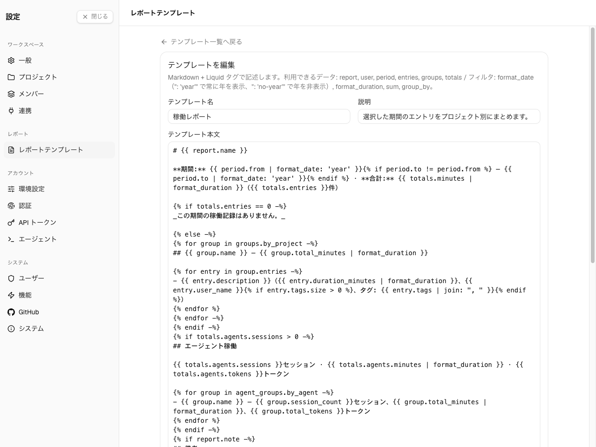

[テンプレートの管理](/ja/admin/report-templates)からテンプレートを開くと編集できます。
エディタには、テンプレートの名前・任意の説明・**本文** — そのテンプレートでレンダリングした
レポートの見た目を定義する Markdown + Liquid — があります。



テンプレート本文は **Markdown** に **Liquid** のプレースホルダーを織り交ぜたものです。レンダリング
時に Spantail がレポートのデータ — 期間・エントリ・エージェント活動・合計 — を差し込み、Liquid を
実行して Markdown を生成します。このページの残りはそのリファレンスです。テンプレートの出力を確認する
には、そのテンプレートで[レポート](/ja/guides/reports/)を作成してください。

## テンプレート言語

Spantail はテンプレートを [LiquidJS](https://liquidjs.com/) でレンダリングするため、標準の Liquid
[タグ](https://liquidjs.com/tags/overview.html)と[フィルタ](https://liquidjs.com/filters/overview.html)
が使えます。`{{ output }}` と ``、`assign`・`capture`・`if` / `elsif` / `else`・`unless`・
`case` / `when`・`for`（`limit`・`offset`・`reversed`・`break`・`continue` 付き）・`increment`・
`comment`・`raw`、`==`・`!=`・`>`・`<`・`and`・`or`・`contains` などの演算子、`upcase`・`size`・
`first`・`join`・`map`・`where`・`sort`・`uniq`・`slice`・`truncate`・`replace`・`plus`・`round`・
`default` などの文字列/数値/配列フィルタです。

その上で、テンプレートは信頼できない入力なので、Spantail はいくつかのルールを適用します。

- **出力は HTML エスケープされます。** 差し込まれる値はすべて `< > & " '` がエスケープされます。
  記述した Markdown（見出し・太字・リスト・`[text](url)` リンク）はそのまま動作しますが、生 HTML と
  山括弧の自動リンク（`<https://…>`）は動作しません。
- **未知のフィルタはエラー**（strict filters）ですが、**未知の変数は失敗せず空になります**。
  タイプミスした `{{ totls }}` はレポートを壊さず、何も出力しません。
- **プロトタイプへのアクセスはできません** — 到達できるのは値自身のプロパティのみです。
- **`include`・`render`・`layout`・`block` タグは無効化**されており、他のファイルを取り込めません。
- **パース・レンダリング・メモリの上限**が課されます（暴走ループや巨大な出力は停止されます）。

## 変数

テンプレート本文で使える変数です。

| 変数 | 型 | 説明 |
|---|---|---|
| `report.name` | string | レポート名。 |
| `report.note` | string \| null | レポートの自由記述ノート、無ければ `null`。 |
| `user.name` | string | レポートを生成するユーザーの名前。 |
| `period.from` | string | 期間の開始 `YYYY-MM-DD`。 |
| `period.to` | string | 期間の終了 `YYYY-MM-DD`。 |
| `period.preset` | string \| null | `today`・`yesterday`・`this_week`・`last_week`・`this_month`・`last_month`、カスタム範囲は `null`。 |
| `period.label` | string | 期間のコンパクトなラベル（例: 月なら `2026-06`）。 |
| `timezone` | string | レポートをレンダリングする IANA タイムゾーン。 |
| `locale` | string | 日付整形を決めるロケール（`en` / `ja`）。 |
| `generated_at` | string | 生成した ISO 8601 の時刻。 |
| `generated_date` | string | レポートのタイムゾーンでの生成日 `YYYY-MM-DD`。`format_date` の年の基準です。 |
| `workspaces` | array | 対象のワークスペース: `{ id, slug, name }`。 |
| `projects` | array | 対象のプロジェクト: `{ id, slug, name, workspace_id }`。 |
| `users` | array | 対象のユーザー: `{ id, name }`。 |
| `agents` | array | セッションが現れる登録済みエージェント: `{ id, name, type }`。 |
| `entries` | array | 作業エントリ — [エントリオブジェクト](#エントリオブジェクト)を参照。 |
| `agent_entries` | array | エージェントセッション — [エージェントセッションオブジェクト](#エージェントセッションオブジェクト)を参照。 |
| `groups` | object | 事前グループ化した作業エントリ — [グループ](#グループ)を参照。 |
| `agent_groups` | object | 事前グループ化したエージェントセッション — [グループ](#グループ)を参照。 |
| `totals` | object | 集計値 — [合計](#合計)を参照。 |

### エントリオブジェクト

`entries`（およびグループの `entries`）の各要素:

| フィールド | 型 | 説明 |
|---|---|---|
| `id` | string | エントリ id。 |
| `workspace_id` | string | 所属ワークスペース id。 |
| `workspace_name` | string | ワークスペース名。 |
| `project_id` | string | プロジェクト id。プロジェクトが無い場合は `""`。 |
| `project_name` | string | プロジェクト名、または `"(no project)"`。 |
| `user_id` | string | 作成者 id。 |
| `user_name` | string | 作成者名。 |
| `entry_date` | string | 作成者のタイムゾーンでのローカル日付 `YYYY-MM-DD`。 |
| `duration_minutes` | number | 作業分数。 |
| `description` | string | 作成者が記録した内容。 |
| `note` | string \| null | 長文ノート、無ければ `null`。 |
| `tags` | string[] | エントリのタグ。 |

### エージェントセッションオブジェクト

`agent_entries`（およびエージェントグループの `entries`）の各要素:

| フィールド | 型 | 説明 |
|---|---|---|
| `id` | string | セッション id。 |
| `workspace_id` / `workspace_name` | string | 所属ワークスペース。 |
| `project_id` / `project_name` | string | プロジェクト、または `""` / `"(no project)"`。 |
| `user_id` / `user_name` | string | エージェントが代わりに動いたユーザー。 |
| `agent_id` / `agent_name` | string | セッションを生成したエージェント。 |
| `entry_date` | string | レポートのタイムゾーンでのセッション開始のローカル日付 `YYYY-MM-DD`。 |
| `duration_minutes` | number | セッション時間。 |
| `total_tokens` | number | 合計トークン（使用量が無い場合は 0）。 |
| `input_tokens` / `output_tokens` | number | 入力/出力トークン。`input + output` は `total` **未満**になることがあります — 相互に導出しないでください。 |
| `cache_creation_tokens` / `cache_read_tokens` | number | キャッシュのトークンバケット。 |
| `cost_usd` | number \| null | USD のコスト、無ければ `null`。 |
| `model` | string \| null | モデル名、無ければ `null`。 |
| `description` | string \| null | セッションの要約、無ければ `null`。 |
| `started_at` / `ended_at` | string \| null | ISO 8601 の時刻、無ければ `null`。 |

### グループ

`groups` は作業エントリを 3 通りに、`agent_groups` はエージェントセッションを 4 通りに事前
グループ化して持ちます。それぞれ**グループの配列**で、（名前順、`by_date` はキー順で）ソートされます。

- `groups.by_date`・`groups.by_project`・`groups.by_user`
- `agent_groups.by_date`・`agent_groups.by_project`・`agent_groups.by_user`・`agent_groups.by_agent`

作業エントリのグループは次を持ちます。

| フィールド | 型 | 説明 |
|---|---|---|
| `key` | string | グループ化キー（日付・プロジェクト id・ユーザー id）。 |
| `name` | string | グループの表示名（プロジェクト名やユーザー名）。`by_date` には無いので `key` を使います。 |
| `entries` | array | このグループの[エントリ](#エントリオブジェクト)。 |
| `total_minutes` | number | グループの作業分数の合計。 |

エージェントグループは `total_tokens` と `session_count` を加え、`entries` は
[エージェントセッション](#エージェントセッションオブジェクト)です。

### 合計

| フィールド | 型 | 説明 |
|---|---|---|
| `totals.minutes` | number | 人の作業分数の合計。 |
| `totals.hours` | number | 人の作業時間の合計（小数 2 桁）。 |
| `totals.entries` | number | 作業エントリ数。 |
| `totals.agents.sessions` | number | エージェントセッション数。 |
| `totals.agents.minutes` / `totals.agents.hours` | number | エージェントセッションの時間。 |
| `totals.agents.tokens` | number | エージェントの合計トークン。 |
| `totals.agents.input_tokens` / `totals.agents.output_tokens` | number | エージェントの入力/出力トークン。 |

## カスタムフィルタ

標準の Liquid フィルタに加えて、Spantail は 4 つを登録しています。

### `format_date`

`YYYY-MM-DD` の文字列（ISO タイムスタンプは日付部分に短縮）を、レポートの言語で曜日付きの
ローカル日付に整形します。`{{ period.from | format_date }}` → `6月1日(月)`（英語では `Mon, Jun 1`）。
日付でない入力はそのまま返されます。

既定では、年はレポートの生成年と異なる場合にのみ表示されます。今年についてのレポートが冗長に
ならないためです。引数で上書きできます。

- `{{ date | format_date }}` — 曜日と月日。年は他の年のときだけ表示。
- `{{ date | format_date: 'year' }}` — 常に年を表示（`2026年6月1日(月)`）。
- `{{ date | format_date: 'no-year' }}` — 年を表示しない。

スターターテンプレートは `'year'` を渡すため、期間行と生成日には常に年が付きます。`format_date` は
時刻を一切表示しません。

### `format_duration`

分数を `1h 30m`（ロケール非依存）に整形します。`{{ totals.minutes | format_duration }}`。

### `sum`

数値、またはオブジェクトのリストの数値プロパティを合計します。

```liquid
{{ entries | sum: "duration_minutes" | format_duration }}
```

### `group_by`

オブジェクトのリストをプロパティでグループ化し、`{ key, items }` のグループを返します。組み込みの
`groups` / `agent_groups` が用意していない切り口（例えば `map` の後にタグで）に使えます。

```liquid

## {{ g.key }}
- {{ e.description }}

```

## テンプレートからのレポート初期値

本文に加えて、テンプレートは、そこから作成する新規レポートの開始状態を事前に埋められます。

- **レポート名の初期値**・**ノートの初期値** — レポートの初期の名前とノートを生成する Liquid です。
  レポートフォームはこれを採用し、作成者が手で欄を編集するまで同期し続けます。これらは本文と
  **同じ変数**でレンダリングされますが、レポートにはまだエントリが無いため、`entries`・
  `agent_entries`・`groups`・`agent_groups`・`agents` は空、`totals` は 0 です。ここで役立つのは
  `user`・`workspaces`・`projects`・`users`・`period`（`period.label` を含む）です。
- **デフォルトの期間** — 新規レポートが始まる期間: 今日・昨日・今週・先週・今月・先月。未設定の
  場合は今日にフォールバックします。

## 安全性

レポートテンプレートはユーザー入力なので、レンダリングは設定不要のロックダウンされたサンドボックス
で実行されます。設定する必要はありませんが、把握しておくとよいでしょう。

- 到達できるのはテンプレート自身のデータのみ — プロトタイプへのアクセスはなく、安全な組み込み
  フィルタだけが使えます。
- パース・レンダリング・メモリの上限が課されます。
- file/include 系タグ（`include`・`render`・`layout`・`block`）は無効化されており、テンプレートが
  他のファイルを取り込むことはできません。
- レンダリング後の Markdown は**生 HTML を素通しせず**に表示されます — 埋め込まれた HTML は実行
  されません。

これらの保護は無効化できません。
