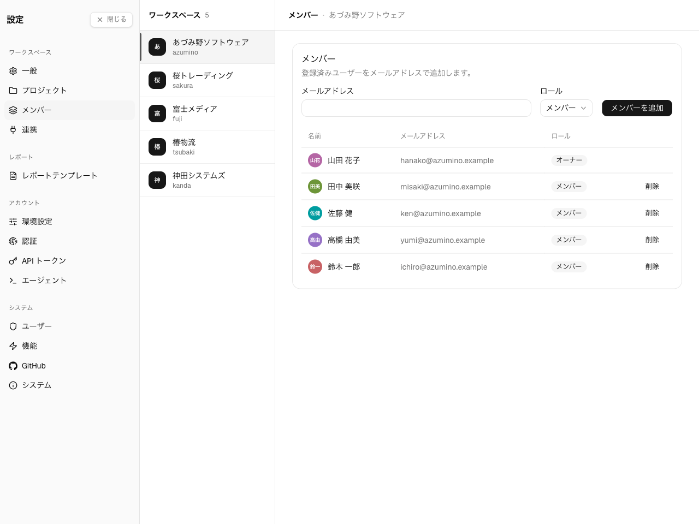

**Settings → ワークスペース → メンバー。** ワークスペースの**オーナー**と**管理者**に表示
されます。メンバーには名簿が読み取り専用で表示されます。

ワークスペースのメンバーとは、そのワークスペースを閲覧し作業を記録できるユーザーです。各メンバー
は 3 つのロールのいずれかを持ちます。

## ロール

| ロール | できること |
|---|---|
| **オーナー** | 管理者ができることすべて。ワークスペース作成時に設定され、削除できず、最後の管理者を割り込んで降格させることもできない。 |
| **管理者** | ワークスペースの設定・プロジェクト・メンバーを管理。 |
| **メンバー** | ワークスペースの閲覧と作業の記録。管理操作は不可。 |

ワークスペースには常に最低 1 人のオーナー/管理者が必要なため、それを 0 にしてしまう操作は
ブロックされます。

## メンバーを追加する

相手の**メール**を入力し、**ロール**(メンバーまたは管理者)を選んで **追加** を選びます。
メールはインスタンス上に既存のユーザーのものである必要があります — メンバー追加でアカウントが
作成されるわけではありません。

インスタンスに全く新しい人をまず迎え入れるには、インスタンス管理者が[ユーザー管理](/ja/admin/users)
で作成または招待します。アカウントができたら、ここで追加します。

## メンバーを削除する

メンバーの行アクションから削除します。オーナーは削除できません。メンバーを削除するとそのワーク
スペースへのアクセスが失われますが、本人が作成したエントリはワークスペースに残ります。

メンバーシップはワークスペースごとに独立しています — あるワークスペースでは管理者、別のワーク
スペースでは一般メンバー、ということが可能です。
