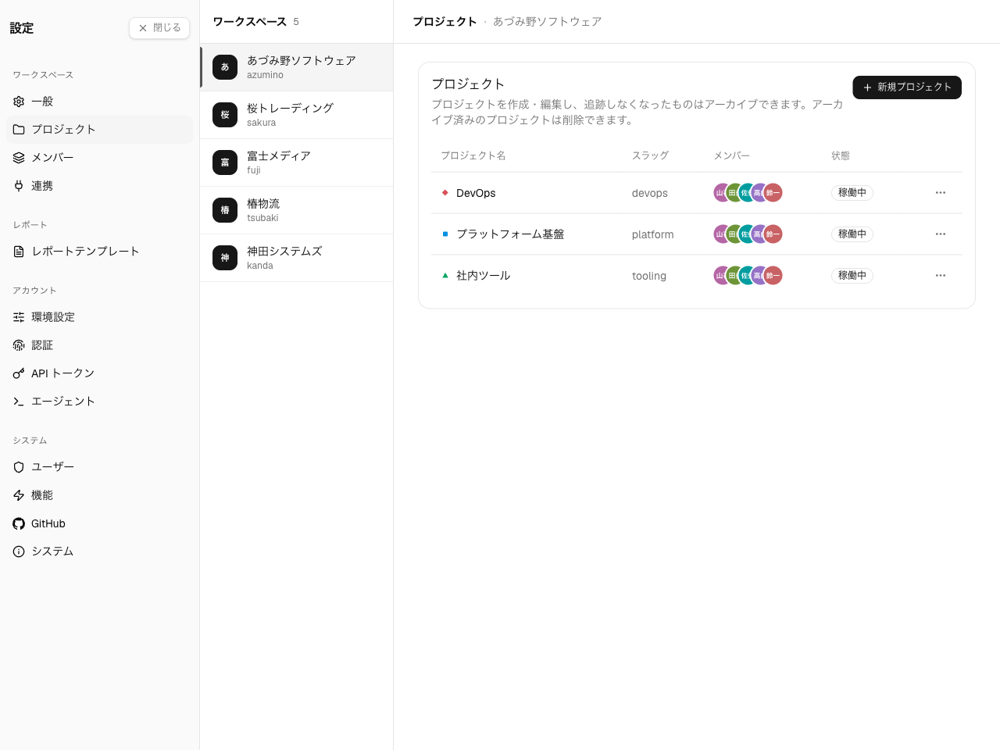
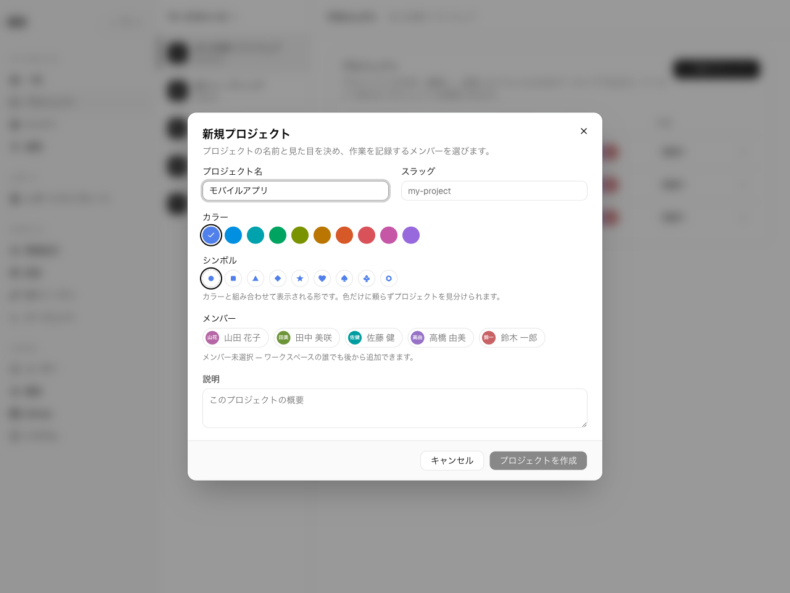

**Settings → ワークスペース → プロジェクト。** ワークスペースの**オーナー**と**管理者**に
表示されます。

プロジェクトはワークスペース内の作業を整理する単位です。メンバーは作業エントリやエージェントの
活動をプロジェクトに割り当て、レポートを 1 つのプロジェクトにスコープできます。プロジェクトの
メンバーシップは、そのプロジェクトのエントリを誰が閲覧できるかも制御します。

## プロジェクトを作成する

**新規プロジェクト** を選び、次を設定します。

- **名前** — プロジェクトの表示名。
- **URL** — プロジェクトのリンクで使うスラッグ。半角小文字・数字・ハイフン。
- **色** — タイムラインやレポート全体でプロジェクトを示すアクセント色。
- **シンボル** — 色とともに表示される形。色だけに頼らずプロジェクトを見分けられます。
- **メンバー** — 任意。ワークスペースのメンバーから初期メンバーを選択。
- **説明** — 任意。プロジェクトに併記されます。

## プロジェクトを編集する

プロジェクトの行アクションから、名前・URL・説明・色をいつでも変更できます。

## メンバー

プロジェクトのメンバーシップは「所属しているか/していないか」の二択で、プロジェクト単位の
ロールはありません。そのプロジェクトのエントリを閲覧できるのは、プロジェクトメンバー
(およびワークスペース管理者)だけです。メンバーは各プロジェクトの行から管理し、ピッカーには
ワークスペースのメンバーが一覧表示されます。

プロジェクトに誰かを追加するには、その人が事前にワークスペースのメンバーである必要があります。
[メンバーとロール](/ja/admin/members)を参照してください。

## アーカイブと復元

プロジェクトを**アーカイブ**すると、履歴を失わずに運用から外せます。アーカイブ済みプロジェクト
はアクティブなピッカーから消えますが、全エントリは保持され、後で**復元**できます。

## プロジェクトを削除する

プロジェクトの削除は元に戻せません。ただしその作業エントリとエージェントセッションは削除されず、
**未割り当て**(プロジェクトへの関連付けが外れた状態)になってワークスペースに残ります。実行前に
確認ステップでこの点が明示されます。

運用から外したいだけなら**アーカイブ**を選び、**削除**は誤って作成したプロジェクトに限って
使ってください。
