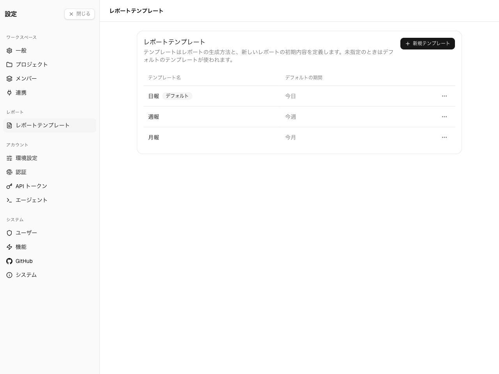

**Settings → レポート → レポートテンプレート。** **インスタンス管理者**と、**テンプレート作成者**
権限を持つユーザーが利用できます。

テンプレートは**提示の書式**にすぎません。ワークスペース・プロジェクト・ユーザー・期間からは独立
しています。レポートを作成するとき、利用者は任意のテンプレートを任意のスコープと期間に自由に
組み合わせます。テンプレートはインスタンス共通なので、すべてのワークスペースが同じ一覧から選びます。

## スターターテンプレートは常に用意される

新規インスタンスにはテンプレートが 1 つもありません。一覧が初めて読み込まれたとき、Spantail は
**スターターテンプレート**を 1 つ(リクエストの言語で)遅延シードし、レポートが常に作成可能な状態を
保ちます。シードは冪等で、一度だけ追加され重複しません。他のテンプレートと同様に編集・無効化・
差し替えが可能です。

## デフォルトテンプレート

テンプレートの 1 つを**デフォルト**に指定できます — 新規レポートの作成時にコンポーザが最初に選ぶ
テンプレートです。テンプレートの**デフォルトに設定**でフラグを移します。フラグを持てるのは常に
1 つだけで、一覧では**デフォルト**バッジが付きます。デフォルトテンプレートは、フラグを持つ間は
削除・無効化できません — 先に別のテンプレートをデフォルトに設定して外してください。シードされた
**日報**テンプレートは最初からデフォルトになっているため、新規インスタンスにも常に既定が 1 つあります。

## テンプレートを管理する

- 名前・任意の説明・本文を指定してテンプレートを**作成**します。
- 名前・説明・本文をいつでも**編集**できます。
- テンプレートの**有効化/無効化** — 無効化したテンプレートは一覧には残りますが、レポート作成時の
  ピッカーからは隠れます。
- テンプレートを**デフォルトに設定** — レポートコンポーザが最初に開くテンプレートにします
  ([デフォルトテンプレート](#デフォルトテンプレート)を参照)。
- 不要になったテンプレートを**削除**します。

本文そのもの — Markdown、Liquid のデータとフィルタ、日付の整形、テンプレートのレポート初期値 —
は[テンプレートの編集](/ja/admin/editing-templates)で扱います。
