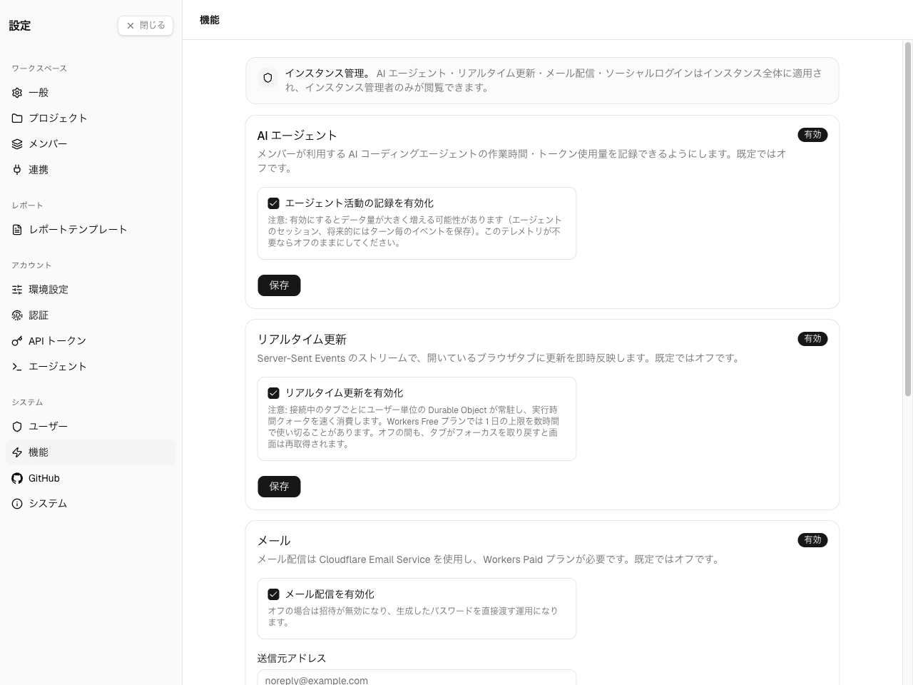
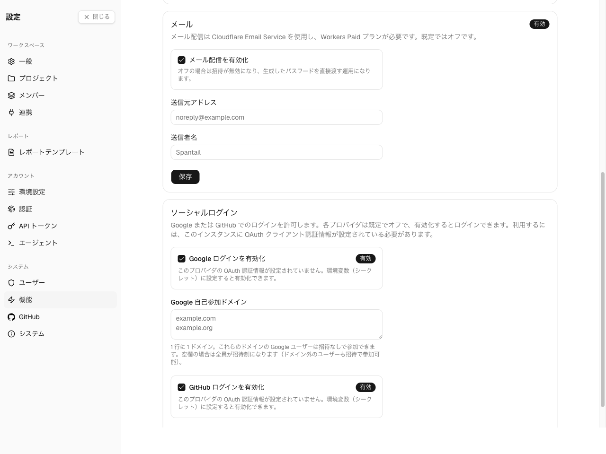
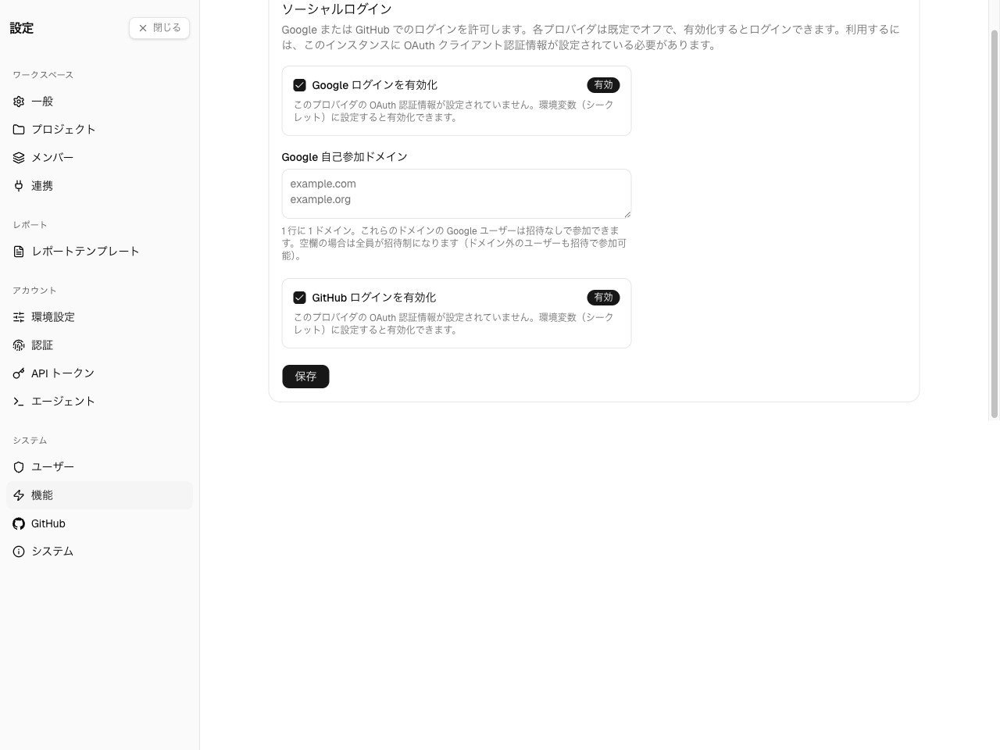
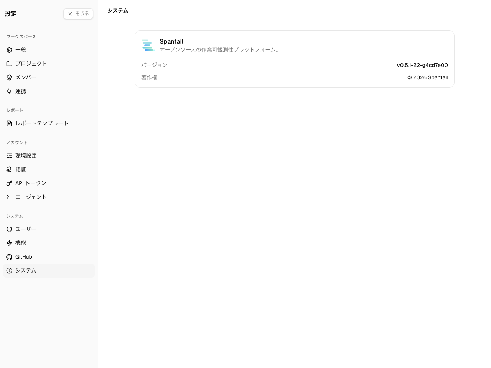

Settings の**システム**グループは、インスタンス全体の管理をまとめています。**ユーザー**と
**GitHub** はそれぞれ専用ページがあり（[ユーザー管理](/ja/admin/users)、
[GitHub 連携](/ja/admin/github-integration)）、このページでは残りの 2 つ — インスタンス全体の
スイッチが並ぶ**機能**ページと、バージョンを表示する**システム**ページ — を扱います。

これらの機能が依存する認証情報 — SMTP/メールルーティングと OAuth クライアントシークレット —
は、この UI ではなくデプロイ時に環境シークレットとして一度だけ設定します。セットアップガイドの
[設定](/ja/self-hosting/configuration)を参照してください。

## 機能

**Settings → システム → 機能。** **インスタンス管理者のみ**の 1 ページで、インスタンス全体の
機能スイッチ — AI エージェント・リアルタイム更新・メール・ソーシャルログイン — をまとめます。
それぞれ独立してトグルし、**保存**するカードです。

### AI エージェント

エージェント活動機能の単一スイッチです。

- **オン** — ユーザーはエージェントを作成でき、**アカウント → エージェント**画面が表示されて、
  AI エージェントがセッションを取り込めるようになります。
- **オフ**（既定）— エージェントの UI は隠れ、新規エージェントは作成できません。

オンにするとデータ量が大きく増えうるため（各エージェントセッション、さらにターン単位の
イベントが保存されます）、そのテレメトリが必要でない限りオフのままにしてください。

### リアルタイム更新

Server-Sent Events による即時更新の単一スイッチです。

- **オン** — 開いているブラウザタブが、変更（新しいエントリ・プロジェクト・レポート・
  メッセージ）を発生と同時に、リロードなしで受け取ります。
- **オフ**（既定）— 画面はタブがフォーカスを取り戻すたびに更新されます。その間は何も
  プッシュされません。

このスイッチがあるのは、接続中のタブごとにユーザー単位の Durable Object が動き続け、その稼働
時間が Cloudflare アカウントの日次クォータを消費するためです。**Workers Free プラン**では、
数人のアクティブユーザーで数時間のうちに使い切ることがあります。Workers Paid プランで、または
Free プランでも利用者がごく少数のときに有効にしてください。オフにすると新規接続に適用され、
既に開いているタブはリロードするまでストリームを保ちます。

### メール

Spantail がメール（招待・パスワードリセット・レポート配信）を送るかどうかを制御します。
Cloudflare Email Service を使い、Workers Paid プランが必要です。既定はオフです。

配信には、Worker を動かしている Cloudflare アカウント側で **Email Sending** の事前設定が
必要です。送信元アドレスのドメインがそのアカウントのゾーンである必要があり、
**Compute & AI → Email Service → Email Sending → Onboard Domain**（必要な SPF・DKIM の
DNS レコードが自動追加されます）または `npx wrangler email sending enable <domain>` で
オンボードします。下の送信元アドレスには、オンボードしたドメインのアドレスを指定します。
[Email Service のはじめ方](https://developers.cloudflare.com/email-service/get-started/)を
参照してください。

- **メール配信を有効化** — 配信をオン/オフします。
- **送信元アドレス** — 送信者アドレス（配信を有効にするには必須）。
- **送信元名** — 任意の分かりやすい送信者名。

送信元アドレスなしにメールを有効化することはできません。これは招待が送信時に失敗するのを防ぐ
ガードです。メールが**オフ**のとき、ユーザーのオンボーディングは、メール招待の代わりに一時
パスワードによる直接作成に切り替わります（[ユーザー管理](/ja/admin/users#ユーザーを追加する)を
参照）。

### ソーシャルログイン

メールとパスワードに加えて、**Google** または **GitHub** でのサインインを許可します。

- **プロバイダごとのトグル** — Google と GitHub を個別に有効化します。各プロバイダは、環境に
  OAuth 認証情報が設定されて初めて有効化でき、それまではヒント付きで無効のままです。
  プロバイダへの OAuth アプリの登録と、クライアント ID・シークレットの Worker への設定は
  [設定 → ソーシャルログイン](/ja/self-hosting/configuration/#ソーシャルログイン)を参照して
  ください。
- **Google 自己参加ドメイン** — 1 行に 1 ドメイン。これらのドメインの Google ユーザーは
  **招待なし**で参加できます。空欄にすると全員が招待制になります（ドメイン外のユーザーも
  招待は可能）。

ソーシャルログインは、インスタンスに最初の管理者ができるまで利用できません。セットアップ前に
ソーシャルサインインでインスタンスを乗っ取られないための意図的な安全策です。ブートストラップの
ルールは[セキュリティ](/ja/self-hosting/security)を参照してください。

## システム

**Settings → システム → システム。** システムの他のページと違い、このページは**全ユーザーに
表示**されます（インスタンス管理者だけではありません）— 誰でもインスタンスの稼働バージョンを
確認できます。

製品名・稼働中の**バージョン**（対応する GitHub リリースへリンク）・**著作権**を表示します。
ここに設定する項目はありません。

