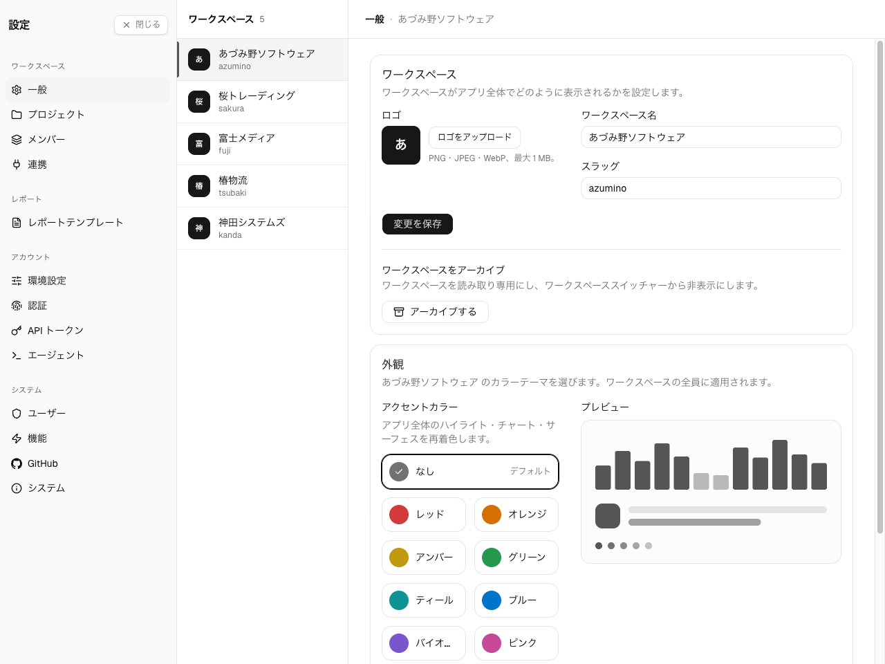

**Settings → ワークスペース → 一般。** ワークスペースの**オーナー**と**管理者**に表示されます。
メンバーには読み取り専用の案内が表示されます。

各ワークスペースは独自の識別情報 — 名前・URL スラッグ・ロゴ・アクセントカラー — を持ち、
所属する全員で共有されます。中央の**ワークスペース**ペインで、これらの設定を編集する対象の
ワークスペースを選べます。

## 名前と URL

- **名前** — ワークスペースの表示名。ワークスペーススイッチャーや UI 全体に表示されます。
- **URL** — ワークスペースのリンクで使われるスラッグ(`/w/<slug>/…`)。半角小文字・数字・
  ハイフンのみ、最大 50 文字。

スラッグを変更するとワークスペースの URL が書き換わります。旧スラッグへのブックマークは解決
できなくなるため、変更は慎重に行い、メンバーに周知してください。

いずれかを編集して **保存** を選びます。

## ロゴ

ロゴはサイドバーのワークスペーススイッチャーに表示されます。未設定の場合は、頭文字から生成
されたアバターが代わりに表示されます。

- **アップロード** — **PNG・JPEG・WebP** のいずれか、最大 **1 MB**。
- **削除** — ロゴを消去し、頭文字アバターに戻します(ロゴを設定すると表示されます)。

## 外観

ワークスペースの**アクセントカラー**を選びます。アプリ全体のハイライト・チャート・サーフェスを
ワークスペースの全員に対して再着色し、その場でプレビューできます。既定の中立テーマにするには
**なし**のままにします。

## アーカイブ

ワークスペースカードでは、ワークスペースのアーカイブと復元も行えます。アーカイブされた
ワークスペースは**読み取り専用**です。復元するまで、作業の記録、エージェント活動のキャプチャ、
プロジェクト・メンバー・設定の変更はできません。既存のデータは引き続き閲覧でき、レポートの
対象にもできます。

アーカイブされたワークスペースはサイドバーのワークスペーススイッチャーから消えます。復元するには、
設定のワークスペースペインで選択し（**アーカイブ済み**バッジ付きで表示され続けます）、
**復元する** を選びます。

## Danger Zone

**ワークスペースを削除** は、プロジェクト・メンバー・作業エントリ・キャプチャされたエージェント
活動を含むワークスペース全体を完全に削除します。この操作は取り消せません。

削除できるのは**ワークスペースのオーナー**（およびインスタンス管理者）だけです。確認のため、
ダイアログにワークスペースのスラッグを入力します。一致するまで削除ボタンは無効のままです。
アーカイブされたワークスペースは復元せずに削除できます。

次は[プロジェクト](/ja/admin/projects)で作業を整理するか、[メンバーとロール](/ja/admin/members)で
ワークスペースの所属を管理します。
