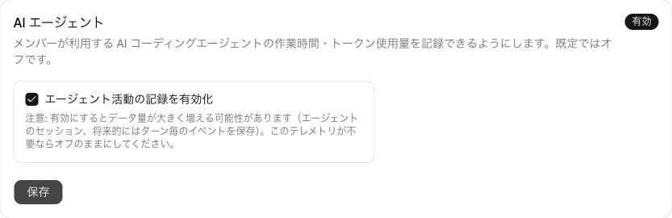
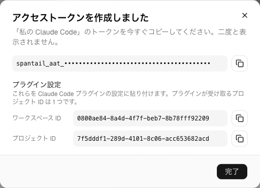
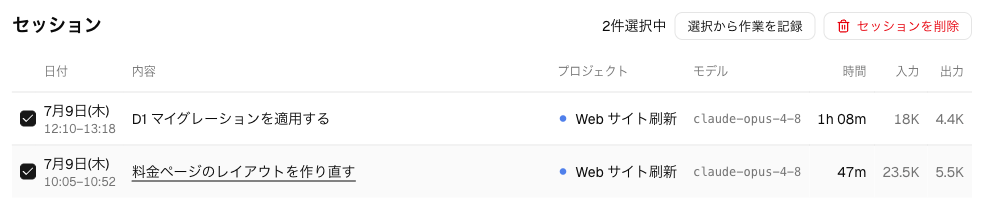
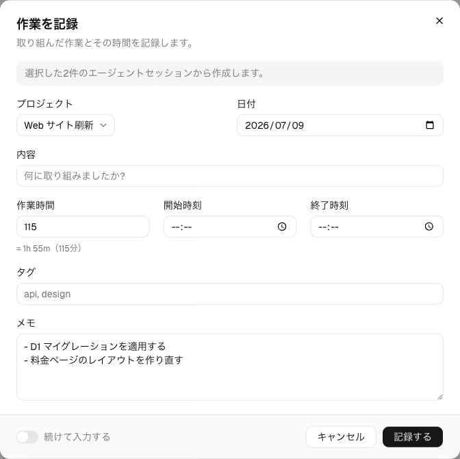

import { Steps } from "@astrojs/starlight/components";

Spantail は人の作業を**作業エントリ**として、AI エージェントの活動を**エージェントセッション**として
記録します。このページはその後半を扱います。Claude Code 用の Spantail プラグインが
セッションを自動で記録し、あなたはそれを作業エントリとレポートに変えます。Web アプリからも、
Claude Code の中からも。

[クイックスタート](/ja/getting-started/) の続きから始めます。読み終える頃には、自分の
Claude Code のセッションが作業と並んでタイムラインに現れ、エディタを離れずに作業エントリと
レポートを作れるようになっています。

## 事前準備

- 自分のインスタンス、ワークスペース、プロジェクトがあること
  （[クイックスタート](/ja/getting-started/) を終えた状態）。
- **Claude Code v2.1.143 以降**。プラグインの設定機能が入ったバージョンです。
- `bash`・`jq`・`curl` が `PATH` にあること。プラグインの Hooks はシェルスクリプトです。
  ターンを失敗させたり、セッションの終了を妨げたりすることはなく、依存が足りなければ
  黙ってスキップします。`git` は任意で、あればセッションに実行時のブランチとリポジトリが
  付きます。

## セッションを記録して使う

<Steps>

1. **AI エージェントを有効にする**

   エージェント活動の記録は**既定でオフ**で、有効にできるのはインスタンス管理者だけです。
   **設定 → 機能**を開き、**エージェント活動の記録を有効化**をオンにします。

   

   :::caution
   有効にするとデータ量が大きく増える可能性があります。エージェントのセッションと、その裏に
   あるターン毎のイベントが保存されるためです。このテレメトリが不要ならオフのままにして
   ください。
   :::

   インスタンス全体の他のスイッチについては[システム設定](/ja/admin/system-settings/)を
   参照してください。

2. **エージェントを登録し、2 種類のトークンを用意する**

   **設定 → エージェント**（アカウントの下）を開き、**新規エージェント**をクリックします。
   名前を付け、種別に **Claude Code** を選び、セッションを記録するワークスペースを選びます。
   プロジェクトと有効期限は任意です。

   保存すると、**エージェントアクセストークン**（`spantail_aat_…`）が一度だけ表示され、
   併せて**ワークスペース ID** と**プロジェクト ID** も出ます。トークンは二度と
   表示されないので、ここで必ずコピーします。2 つの ID はこのウォークスルーでは
   どこにも貼り付けません。手順 3 の `/spantail:link` スキルが代わりに選んでくれます。

   

   ここまでが 2 種類のトークンの 1 つ目です。エージェントトークンは
   **書き込み専用・取り込み専用**で、エージェント活動を送ることしかできません。
   プラグインのスキルは**あなたとして**動くため、もう 1 つの資格情報が必要です。

   2 つ目が**個人 API トークン**（`spantail_pat_…`）です。**設定 → API トークン**で
   発行してください。手順 5 まで進むなら、ここで作っておきます。

   エージェントとは何か、どのトークンが何をするのかの全体像は
   [エージェント活動を記録する](/ja/guides/capturing-agents/)にあります。

3. **プラグインを導入してセッションを記録する**

   Claude Code で次を実行します。

   ```
   /plugin marketplace add spantail/spantail
   /plugin install spantail@spantail
   ```

   インストール時にスコープを訊かれたら **user** を選びます。1 回のインストールで、
   作業するすべてのリポジトリをカバーします。プラグインの設定はどのスコープを
   選んでもユーザー単位で保存され全リポジトリで共有されるうえ、個人のトークンを
   入れるので、コミットされるファイルに置くべきものでもありません。どのリポジトリの
   セッションをどのワークスペース・プロジェクトに記録するかはこの設定には含まれず、
   次のステップでリポジトリごとに設定します。

   有効化すると **Plugin options** の入力を訊かれます。

   - **Spantail instance URL** — クイックスタートで作ったインスタンスの URL。
     **末尾に `/`（スラッシュ）を付けない**でください
     （`https://spantail.<自分のサブドメイン>.workers.dev`）。付けるとフックの
     リクエスト URL でスラッシュが連続し（`…//api/v1/…`）、Stop と SessionEnd の
     フックが動かなくなります。
   - **Agent access token** — 手順 2 のエージェントアクセストークン
     （`spantail_aat_…`）。
   - **Personal API token** — 手順 2 の個人 API トークン（`spantail_pat_…`）。
     スキルを使うのに必要です。テレメトリのフックだけ使うなら空欄で構いません。
   - **Send plan title as session summary** — **ON** にすると、プランモードを
     使ったセッションの終了時に、プランのタイトルが作業内容の説明として
     送られます。

   続けて、いま作業しているリポジトリで、セッションの記録先をクイックスタートで
   作ったワークスペース・プロジェクトにリンクします。

   ```
   /spantail:link
   ```

   スキルがワークスペースとプロジェクトの候補を提示し（個人 API トークンを設定
   していればプラグインの MCP サーバー経由で。なければ手順 2 の ID を訊かれます）、
   選んだ内容を `.spantail/config.local.json`（個人用・gitignore 対象）に書き込みます。
   記録したいリポジトリごとに繰り返してください。リンクしていないリポジトリは、
   エージェントトークンのワークスペースにプロジェクトなしでフォールバックします。
   有効な設定とリンク忘れは `/spantail:doctor` で確認できます。

   プラグインは 3 つの Hooks を登録し、そのうち送信を行うのは 2 つです。**Stop**
   （ターンの終わり）ごとに、そのターンのトークン使用量・時刻・モデル名を、git のブランチ、
   リポジトリ URL、作業ディレクトリ、Claude Code のバージョン、リクエスト id とともに
   送ります。**SessionEnd** では冪等に再送したうえで、セッションの終了時刻と、その
   セッションが触れたプルリクエストを送って確定させます。**SessionStart** は何も送りません。
   `/spantail:summary` がいま開いているセッションを指定できるよう、セッション id を
   エクスポートするだけです。

   :::note
   Hooks が送るのは**軽量なテレメトリだけ**です。会話の本文、思考、ツールの入出力が端末から
   出ることはありません。唯一の例外はオプトインで、`sendSessionSummary`
   （または単発なら `/spantail:summary on`）を有効にすると、セッションの plan ファイルの
   タイトルが作業内容の説明として送られます。
   :::

   あとは Claude Code をいつもどおり数分使って、セッションを終了します。Spantail に戻り、
   ワークスペースのサイドバーからエージェントを開くと、アクティビティページにそのセッションが
   並んでいます。行を開けば、所要時間・トークン使用量・触れたブランチとリポジトリが見えます。

   設定項目の全容、環境変数による上書き、プラグインなしで Hooks を動かす方法は
   [Claude プラグイン](/ja/guides/tools/claude-plugin/)に、通信の形式は
   [取り込み API](/ja/api/agent-ingest/) にあります。

4. **セッションから作業エントリを作る**

   セッションはエージェントがしたことの記録で、作業エントリは**あなた**がしたことの記録です。
   エージェントのアクティビティページで自分のセッションにチェックを入れ、
   **選択から作業を記録**をクリックします（<kbd>C</kbd> キーでも同じです）。

   

   作業エントリのダイアログが、選択内容から前もって埋まった状態で開きます。所要時間はその合計、
   日付は最も時間を占める日、説明はセッションの説明（複数選んだ場合は代わりに箇条書きの
   メモになります）、プロジェクトは共通のものです。すべて編集でき、何から作られた記録なのかが
   バナーに表示されます。

   

   紐付けられるのは**自分の**セッションだけで、プロジェクトは 1 つに揃っている必要があり、
   一度に選べるのは 50 件までです。保存すると、その作業エントリは元になったセッションと紐付いた
   まま、タイムラインに並びます。

5. **Claude Code から作業エントリとレポートを作る**

   プラグインは**スキル**も持っています。Hooks と違い、スキルは Spantail の MCP 接続を通じて
   **あなたとして**動きます。手順 2 の個人 API トークンが必要なのはそのためです。

   `/spantail:log-work` を引数なしで実行すると、いま話しているセッションの作業から作業エントリを
   提案します。作業内容を要約し、かかった時間を見積もり、記録する前に確認を求めます。
   自由記述を渡せば、その内容で記録できます
   （`/spantail:log-work 認証のバグを修正, 2h, project core`）。

   `/spantail:log-work #123 2h yesterday` は GitHub の issue に対して記録します。
   プロジェクトはサーバー側のリポジトリ対応表から解決され、issue のタイトルとラベルが入り、
   一致するエージェントセッションが紐付けられます。対応表の設定は
   [GitHub 連携](/ja/admin/github-integration/)を参照してください。

   `/spantail:create-report` はレポートを組み立てます。保存する前に必ずプレビューを
   レンダリングして見せてくれます。

   読み取り専用のエージェントも 2 つ付いてきます。作業エントリを振り返る
   `spantail-work-analyst` と、Hooks が集めたセッションのテレメトリを分析する
   `spantail-agent-activity-analyst` です。

</Steps>

## ここまでで作ったもの

Claude Code のセッションが自動で Spantail に流れ込むようになり、それを扱う 2 つの経路が
どちらも通りました。セッションを選んで作業エントリに変える Web アプリと、あなたとして作業エントリや
レポートを作るスキルを備えた Claude Code そのものです。

## 次に読むもの

- [GitHub 連携をセットアップする](/ja/getting-started/github/) — 最後のハンズオン。Issue に
  `@spantail 2h` とコメントし、作業エントリがセッションを見つけるところまで。
- [エージェント活動を記録する](/ja/guides/capturing-agents/) — エージェント、トークン、アクティビティ
  ページの詳細。
- [Claude プラグイン](/ja/guides/tools/claude-plugin/) — すべての設定項目、各 Hook が送る
  もの、プラグインなしで Hooks を動かす方法。
- [MCP](/ja/guides/tools/mcp/) — 他の AI クライアントから同じツールに接続する。
- [レポートとメッセージ](/ja/guides/reports/) — 報告したものを共有し、議論する。
- [GitHub 連携](/ja/admin/github-integration/) — `#123` が解決されるようにリポジトリと
  プロジェクトを対応付ける。
