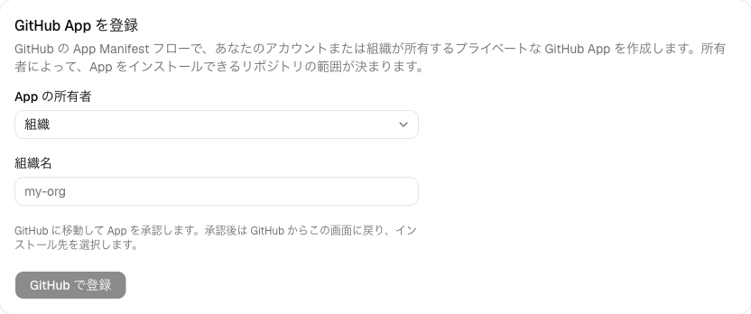
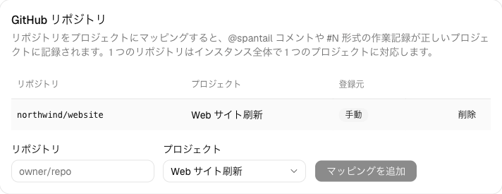
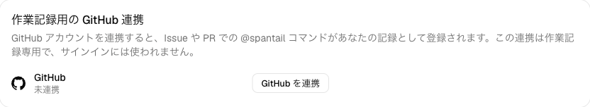

import { Steps } from "@astrojs/starlight/components";

作業が起きる最後の場所は GitHub です。GitHub 連携を設定すると、Issue に
`@spantail 2h` とコメントするだけで、そのリポジトリが属するプロジェクトに作業エントリが
残ります。画面を切り替える必要も、別のウィンドウを開く必要もありません。

このハンズオンは、前の 2 ページの続きです。
[クイックスタート](/ja/getting-started/) でインスタンス・ワークスペース・プロジェクトを作り、
[Claude Plugin をセットアップする](/ja/getting-started/claude-code/) でセッションが流れ込むように
なっています。ここに GitHub が加わり、エージェントがそのリポジトリで動かしたセッションは、
Issue から記録した作業に自動で紐付きます。

## 事前準備

- インスタンスが **GitHub から到達できる**こと。webhook はインターネット経由で届くため、
  [クイックスタート](/ja/getting-started/) でデプロイした `*.workers.dev` の URL なら動作し、
  ローカルの開発サーバーでは動作しません。
- あなたが**インスタンス管理者**であること（App の登録はインスタンス全体に対する一度きりの
  操作です）。加えて、対応付ける先のプロジェクトを含む**ワークスペースの管理者**であること。
- 作業対象の GitHub リポジトリ。自分のアカウント、または App をインストールできる組織が
  所有しているもの。

## GitHub とプロジェクトをつなぐ

<Steps>

1. **App を登録する**

   Spantail のインスタンスは、それぞれ**専用の** GitHub App を登録します。webhook の宛先が
   インスタンスの URL である以上、共通の App を配ることはできないからです。

   **設定 → システム → GitHub** を開き、所有者（個人アカウント、または所属する組織）を選んで
   **GitHub で登録**をクリックします。GitHub がこれから作る App の内容を表示するので、承認
   します。

   

   GitHub は新しい App の資格情報（秘密鍵・webhook シークレット・クライアントシークレット）を
   そのままインスタンスへ返し、インスタンスはそれを暗号化して保存します。コピー＆ペーストは
   一切ありません。App は所有者にとってプライベートで、連携に必要な権限だけを要求します
   （Issue と Pull Request の読み書き、メタデータの読み取り）。

2. **リポジトリにインストールする**

   登録の直後、GitHub は App の**インストール先**を尋ねます。リポジトリを所有するアカウント
   または組織を選び、Spantail が扱ってよいリポジトリを選択します。2 回目以降のインストールは、
   同じ設定画面からリンクされている App の GitHub ページから行います。

   インストール先は、webhook が届き次第 **設定 → システム → GitHub** に表示されます。

3. **リポジトリをプロジェクトに対応付ける**

   マッピングは「このリポジトリから記録された作業は、このプロジェクトのものである」という
   宣言です。

   **設定 → ワークスペース → 連携**を開きます。App が到達できるリポジトリは**未マッピングの
   リポジトリ**に並ぶので、対応付けたいものに
   [クイックスタート](/ja/getting-started/) で作ったプロジェクトを選んでマッピングします。

   

   1 つのリポジトリは、インスタンス全体で 1 つのプロジェクトに対応します。任意の
   `owner/repo` を手動で追加することもでき、その場合は App が無くても動きます（何が制限
   されるかは [GitHub 連携](/ja/admin/github-integration/) を参照）。

4. **自分の GitHub アカウントを連携する**

   Spantail は**あなた**の作業として記録するため、GitHub のログインがどの Spantail
   ユーザーのものかを知る必要があります。**設定 → アカウント → 認証**を開き、**作業エントリ用の
   GitHub 連携**で **GitHub を連携**をクリックします。

   

   この認可はアカウントの所有を証明するだけです。リポジトリへのアクセス権は与えず、サインイン
   の手段にもなりません。GitHub から作業を記録したいメンバーは、各自が一度ずつ連携します。

5. **Issue から作業を記録する**

   マッピングしたリポジトリの Issue または Pull Request に、こうコメントします。

   ```text
   @spantail 2h yesterday
   ```

   Spantail が 👍 のリアクションを付け、その Issue の累計とともに返信します。

   ```text
   ✅ Logged 2h on 2026-07-05 (total on this issue: 3.5h)
   ```

   作業エントリは対応付けたプロジェクトに入り、説明には Issue のタイトル、タグには Issue の
   ラベル、そして Issue へのリンクが付きます。そのリポジトリで動いた最近のエージェント
   セッションのうち、ブランチや Pull Request がその Issue を指しているものは自動で紐付きます。
   [Claude Plugin をセットアップする](/ja/getting-started/claude-code/) で記録したものです。

   文法は `@spantail <duration> [date]` です。

   - **所要時間** — `30m`、`2h`、`1h30m`、`3.5h`、または分だけの数値（`90`）。
   - **日付**（任意）— `today`、`yesterday`、`2026-07-05`、`7/5`、あるいは `今日`、`昨日`、
     `7月5日`。省略すると、アカウント設定のタイムゾーンでの今日になります。

   書き方を間違えると、bot が直し方を返信します。アカウントを連携する前にコメントすると、
   代わりに連携用のリンクが返ってきます。公開リポジトリでは、オーナー・メンバー・
   コラボレーター以外に対して Spantail は意図的に沈黙します。

</Steps>

## Getting started は以上です

これで一周しました。Cloudflare 上の自分の Spantail インスタンスに、ワークスペースと
プロジェクトがあり、Web アプリで手ずから記録した作業、Claude Code が自動で記録した
セッション、GitHub の Issue から指示して記録した作業が、すべて同じプロジェクトに集まり、
送信・共有・議論できるレポートにまとまります。

## 次に読むもの

- [GitHub 連携](/ja/admin/github-integration/) — 手動マッピング、失敗時に bot が返す内容、
  アンインストールで何が止まるか、といった全容。
- [レポートとメッセージ](/ja/guides/reports/) — ここまでのすべてをレポートにする。
- [作業を記録する](/ja/guides/logging-work/) と
  [プロジェクトとタイムライン](/ja/guides/projects-timeline/) — 日々の Web アプリ。
- [CLI](/ja/guides/tools/cli/) と [MCP](/ja/guides/tools/mcp/) — 同じ API を端末や AI
  クライアントから。
- [ユーザー管理](/ja/admin/users/) — チームを招待して、各自の GitHub アカウントを連携して
  もらう。
