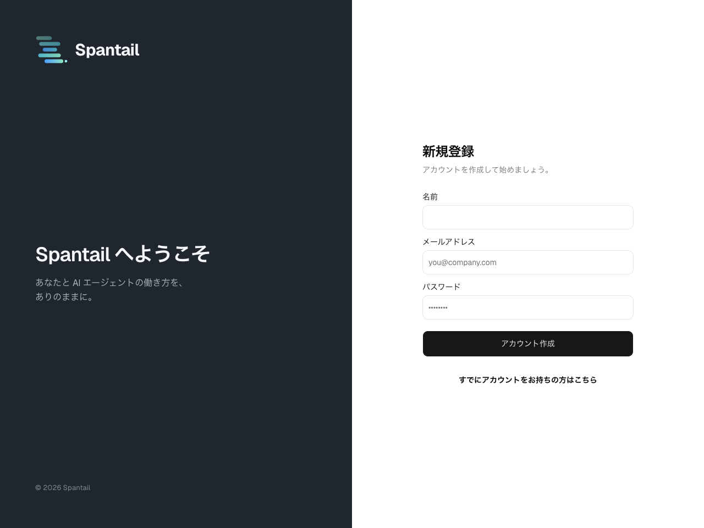
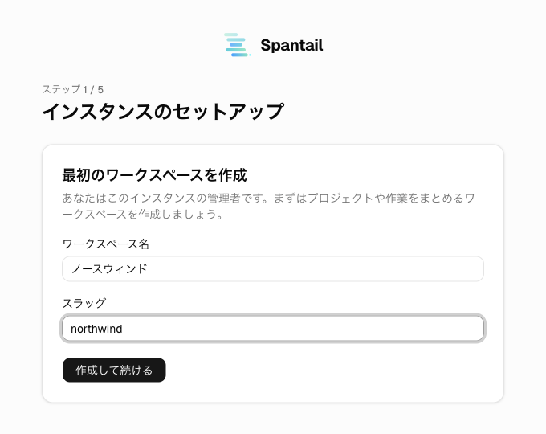
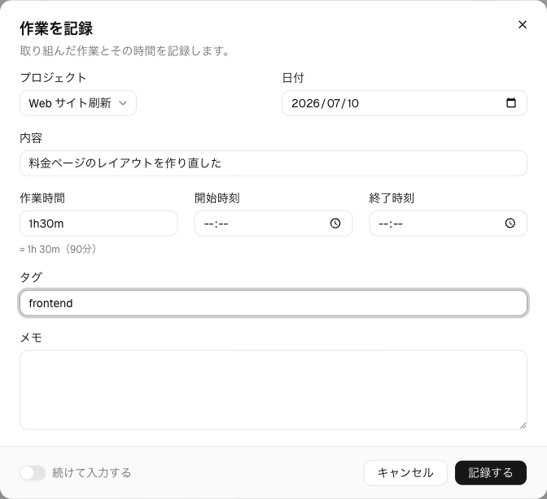
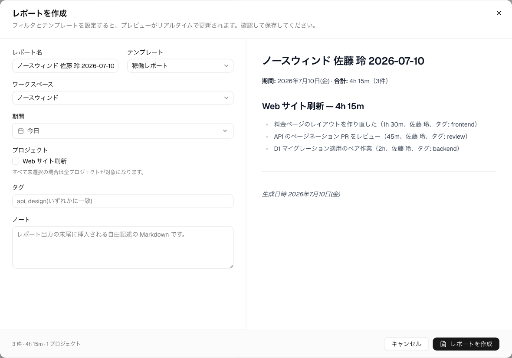
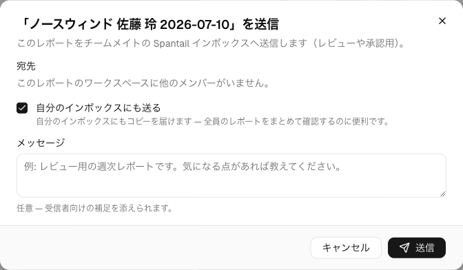
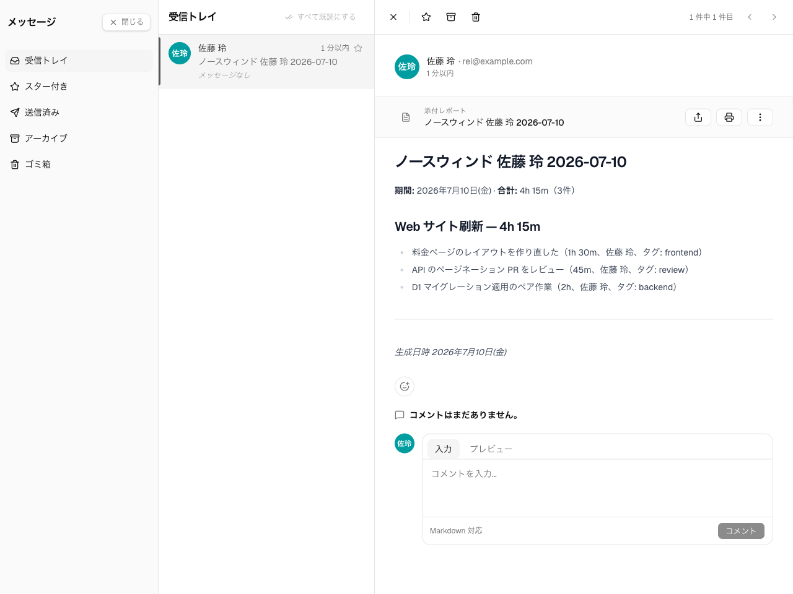

import { Steps } from "@astrojs/starlight/components";

Spantail は作業可視化プラットフォームです。人の作業を**作業エントリ**として、AI
エージェントの活動を**エージェントセッション**として記録し、その両方を**レポート**にまとめます。
セルフホスト型で、1つのデプロイが1つの組織に対応し、すべてがあなたの Cloudflare
アカウント上で動きます。

このページはハンズオンです。空の Cloudflare アカウントから始めて、15 分ほどで、
ワークスペース・プロジェクト・1日分の作業エントリ・自分の受信トレイに届いた日報までを
一気に作ります。各ステップからは、詳しく解説したリファレンスへリンクしています。

## 事前準備

必要なもの:

- **Cloudflare アカウント**（およびリポジトリを clone するための GitHub アカウント）
- **Node.js 24+**、**pnpm 11+**、**Wrangler v4**（`wrangler login` 済みであること）

:::note
Spantail はアップロードされたアバターやロゴを R2 バケットに保存するため、**事前に
Cloudflare アカウントで R2 を有効化**しておく必要があります。R2 には無料枠が
ありますが、有効化には支払い方法の登録が必要です。
:::

リポジトリを clone し、依存関係をインストールします。

```bash
git clone https://github.com/spantail/spantail.git
cd spantail
pnpm install
```

## デプロイしてセットアップする

<Steps>

1. **Wrangler でデプロイする**

   Spantail が必要とする 2 つの Cloudflare リソースを作ります。

   ```bash
   wrangler d1 create spantail-db
   wrangler r2 bucket create spantail-uploads
   ```

   `wrangler d1 create` が出力した `database_id` を、`apps/web/wrangler.jsonc` の
   `d1_databases` ブロックに設定します（既定ではプレースホルダが入っています）。
   次にセッション署名用のシークレットを設定します。32 文字以上の任意の値で、
   たとえば `openssl rand -base64 32` で生成できます。

   ```bash
   pnpm --filter web exec wrangler secret put BETTER_AUTH_SECRET
   ```

   シークレットは Worker に属し、Wrangler はその名前を `apps/web/wrangler.jsonc`
   から読み取ります。リポジトリ直下ではなく、`web` パッケージ経由で実行してください。

   :::caution
   このシークレットが無いと Worker は **fail closed** になります。偽造可能な値で
   セッションに署名するのではなく、認証やセッションに触れるリクエストがすべて
   エラーになります。
   :::

   マイグレーションを適用してから、デプロイします。順番が重要です。

   ```bash
   pnpm db:migrate:remote
   pnpm run deploy
   ```

   :::note
   必ず `pnpm run deploy` を使ってください。`pnpm deploy` は pnpm の組み込み
   コマンドで、まったく別の動作をします。
   :::

   Wrangler がインスタンスの `*.workers.dev` の URL を表示します。Spantail は
   リクエストから origin を導出するため、オリジンの設定は不要です。カスタム
   ドメインの割り当て、ソーシャルログインの有効化、手元からではなく push ごとに
   Cloudflare にデプロイさせる方法は、[Cloudflare へのデプロイ](/ja/self-hosting/deploy/)
   と [設定](/ja/self-hosting/configuration/) を参照してください。

2. **インスタンス管理者になる**

   表示された URL を開きます。まっさらなインスタンスでは、最初のアカウントが
   作られるまで公開サインアップが開いています。**メールアドレスとパスワードで
   最初にサインアップした人がインスタンス管理者**になり、その時点でサインアップは
   閉じます。以降のメンバーは招待で参加します。

   

   サインアップすると、セットアップウィザードに着地します。ウィザードは 5
   ステップありますが、ここで重要なのは最初の 2 つです。

   - **最初のワークスペースを作成** — 名前とスラッグ。ワークスペースは
     プロジェクトと作業をまとめる組織の単位です。
   - **プロジェクトを作成** — 名前とスラッグ。プロジェクトは記録する作業を
     まとめる単位です（作業エントリはワークスペース全体のままにもできます）。

   **インスタンス設定**と**メンバーを招待**は今回スキップします。メール配信には
   Workers 有料プランと認証済みの送信ドメインが必要で、メンバーは後から
   [ユーザー管理](/ja/admin/users/) で招待できます。ウィザードを終えると、作成した
   ワークスペースのダッシュボードに着地します。

   

   ウィザードが扱うのは初回起動時だけで、設定した内容はあとから設定ハブで変更
   できます。[初期セットアップウィザード](/ja/self-hosting/setup-wizard/)、
   [ワークスペース設定](/ja/admin/workspace-settings/)、
   [プロジェクト](/ja/admin/projects/) を参照してください。

3. **その日の作業を記録する**

   ダッシュボードにはワークスペースのタイムラインが表示されます。**+** ボタン
   （または <kbd>C</kbd> キー）で作業エントリのダイアログを開き、入力します。

   - **日付** — 既定は自分のタイムゾーンでの今日。
   - **所要時間** — `90`、`90m`、`1.5h`、`1h30m` はいずれも同じ意味です。
   - **説明** — 何をしたか。
   - **プロジェクト** — さきほど作ったもの。

   保存すると、作業エントリがタイムラインに表示されます。次のステップのレポートに中身を
   持たせるため、2〜3 件入れておきましょう。**続けて入力する**のトグルを使うと、
   ダイアログを開いたまま連続で記録できます。

   

   作業エントリの日付は書き込み時に作成者のタイムゾーンで固定されます。ずれている
   場合は[アカウントと設定](/ja/guides/account-preferences/)でタイムゾーンを設定
   してください。詳細は[作業を記録する](/ja/guides/logging-work/)にあります。

4. **日報を作成する**

   レポートはワークスペースではなくユーザーに属するため、サイドバーではなく
   ヘッダーの右上にあります。**レポート**を開き、**新規レポート**をクリックします。
   左がフォーム、右がライブプレビューです。次を設定します。

   - **テンプレート** — 表示形式。この時点でインスタンスにテンプレートは無いので、
     既定のテンプレートが自動で用意され、選択された状態で開きます。
   - **スコープ** — さきほど作ったワークスペース。
   - **期間** — **今日**のプリセット。これが日報にするということです。

   名前とノートはテンプレートから自動で埋まります。保存するとレポートが
   レンダリングされます。

   

   保存されたレポートは不変のスナップショットです。編集すると上書きではなく
   新しいバージョンが追加されるため、レポートは常にレンダリング時点のデータを
   表します。[レポートとメッセージ](/ja/guides/reports/) と
   [レポートテンプレート](/ja/admin/report-templates/) を参照してください。

5. **自分宛てに送信する**

   レポートのツールバーで**送信**をクリックします。宛先は選ばずに、**自分の
   受信トレイにも送る**にチェックを入れて送信します。「自分の受信トレイに
   送りました。」と表示されます。

   

   :::note
   レポートの送信は、アプリ内の**受信トレイ**に凍結されたコピーを届けるもので、
   メール送信ではありません。Spantail がメールを送るのは招待とパスワード
   リセットのときだけで、それもメール配信を設定した場合に限られます。
   :::

   ヘッダー右上の受信トレイを開くと、いま送ったコピーが届いています。送信された
   バージョンごとにディスカッションが付き、送信者とそのバージョンの受信者が
   Markdown のコメントと絵文字リアクションをやり取りできます。

   

</Steps>

## ここまでで作ったもの

自分の Cloudflare アカウント上の Spantail インスタンス、ワークスペース、
プロジェクト、1日分の作業エントリ、そして受信トレイに届いた日報です。記録したデータは
すべてワークスペースに属します。レポートは自分のもので、共有するかどうかも
自分の判断です。

ここで出てきた言葉 — ワークスペース、プロジェクト、作業エントリ、レポート — は
[ユーザーガイドの概要](/ja/guides/)で定義しています。

## 次に読むもの

- [Claude Plugin をセットアップする](/ja/getting-started/claude-code/) — 次のハンズオン。
  エージェントセッションを記録し、作業エントリとレポートに変える。
- [作業を記録する](/ja/guides/logging-work/) — Web UI で作業を記録する。
- [プロジェクトとタイムライン](/ja/guides/projects-timeline/) — プロジェクトと作業の
  タイムラインを見る。
- [レポートとメッセージ](/ja/guides/reports/) — レポートの作成・共有・議論。
- [エージェント活動を記録する](/ja/guides/capturing-agents/) — AI エージェントが実行した
  セッションを取り込む。
- [アカウントと設定](/ja/guides/account-preferences/) — API トークン、言語、テーマ、
  タイムゾーン。
- [CLI](/ja/guides/tools/cli/) と [MCP](/ja/guides/tools/mcp/) — Web アプリの外から
  データを記録・取得する。

チームを迎え入れるには、[システム設定](/ja/admin/system-settings/) でメール配信と
ソーシャルログインを有効にし、[ユーザー管理](/ja/admin/users/) からメンバーを
招待してください。
