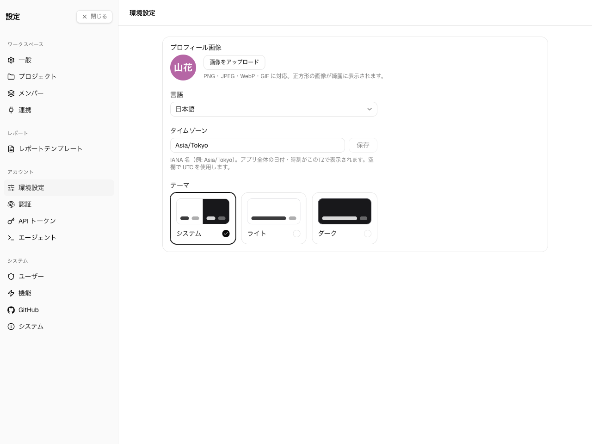
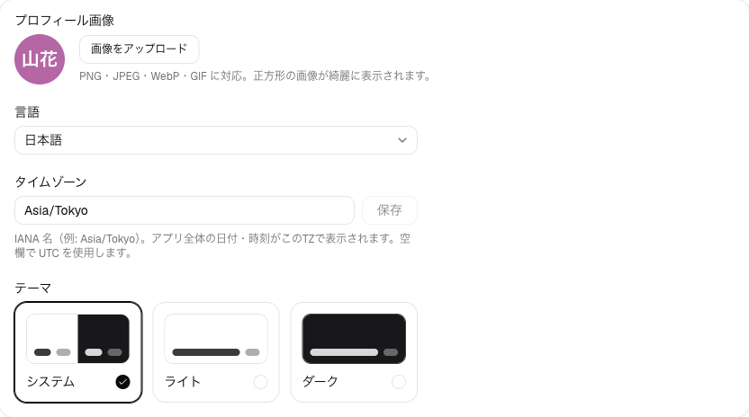
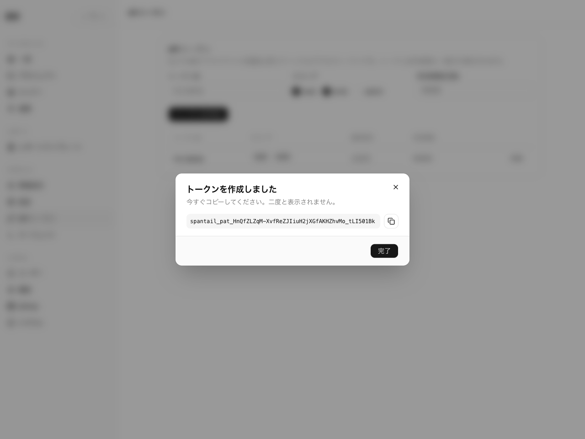

プロフィール・環境設定・サインイン方法・API トークンといった個人設定は、**設定ハブ**に
あります。サイドバー最下部の**設定**の歯車から開きます。ハブは左のサブナビで各セクションを
まとめており、このページでは**アカウント**関連のものを扱います。

## 環境設定

**環境設定**ページには次があります。

- **プロフィール写真** — アバター。あなたの作業が表示される場所に出ます。
- **言語** — UI の言語（英語または日本語）。
- **タイムゾーン** — IANA タイムゾーン（例: `Asia/Tokyo`）。これは重要です。作業エントリの
  日付は書き込み時にあなたのタイムゾーンで凍結され、レポートは相対期間をこのタイムゾーンで
  解決します。未設定の場合は UTC になります。
- **テーマ** — システム・ライト・ダーク。

## 認証

**パスワード**と、連携した **Google / GitHub** アカウントを管理します。利用できる選択肢は、
インスタンスで有効になっているものによります。

## API トークン

[CLI](/ja/guides/tools/cli/)、[MCP](/ja/guides/tools/mcp/)、REST API を使うには、**設定 →
API トークン**で**個人用 API トークン**を作成します。

- **スコープ**を選びます: read・write・admin。作業の記録やレポートの実行には read と write
  で十分です。
- トークンの値は作成時に**一度だけ**表示されます — その場でコピーしてください。紛失した
  場合は失効させて作り直します。
- トークンはいつでも**失効**できます。

