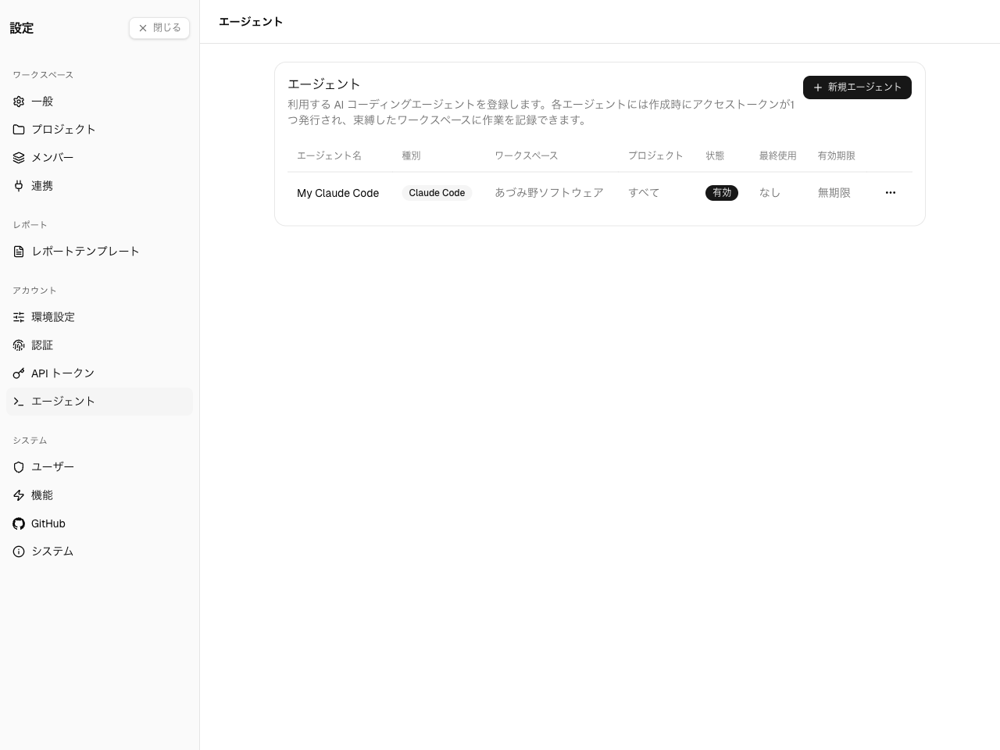
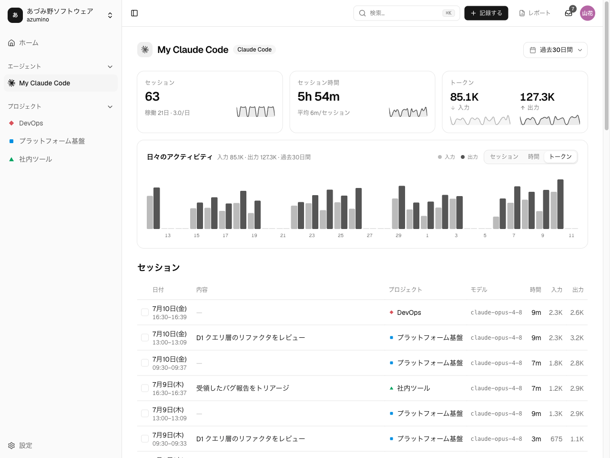

Spantail は、AI エージェントがやったこと — コーディングのセッション、ツール呼び出し、
トークン使用量 — を取り込み、あなたの作業の隣に表示できます。各エージェントの活動ページと、
セッションが紐づいた作業エントリの詳細パネルの両方に現れます。活動は**セッション**単位で
取り込まれ、各セッションが所要時間とトークン使用量を持ちます。セッションはエージェント
ごとにグループ化されます。

:::note
エージェントの取り込みは、管理者がインスタンスで有効にしておく必要があります。以下の
エージェント設定が見当たらない場合は、インスタンス管理者に確認してください。
:::

## エージェントを登録する

**設定 → エージェント**（アカウント内）を開き、エージェントを作成します。各エージェントは
次を持ちます。

- **種類** — 現在は Claude Code のみ。
- **既定のワークスペース** — セッションが入る先。
- **関連プロジェクト**（任意）— 活動をグループ化するため。

エージェントはいつでも有効化・無効化できます。

## エージェントトークンを取得する

各エージェントには1つの**エージェントアクセストークン** — 書き込み専用・**取り込み専用**の
資格情報 — があります。送信できるのはエージェント活動だけで、[CLI](/ja/guides/tools/cli/)・
[MCP](/ja/guides/tools/mcp/)・その他の API には**使えません**（これらは
[個人用 API トークン](/ja/guides/account-preferences/)を使い、あなたとして動作します）。
エージェント登録時にコピーして安全に保管してください。トークンはあなたのワークスペース所属に
スコープされ、取り込みのたびに検証されます。

## 活動を送信する

エージェントはエージェントトークンを使い、自分のターンを取り込みエンドポイント
（`POST /api/v1/agent-events`）に送ります。Spantail はそれをセッションにまとめます。Claude Code
なら専用の **Claude Code プラグイン**（[Claude プラグイン](/ja/guides/tools/claude-plugin/)を参照）が
最も簡単で、セッションを自動で取り込みます。その他のエージェントは、取り込み API を通じて
プログラムから送信します。

取り込まれたセッションは、関連する作業に紐づきます。作業エントリを開くと、詳細パネルに
**エージェントアクティビティ**カードが表示され、紐づいたセッション・入出力トークンの割合・
プルリクエストが見られます。

## エージェント活動を確認する

エージェント活動ページを開くと、期間内のセッションを、統計・プロジェクト別の内訳・
トークン使用量とともに確認できます。これは読み取り専用のロールアップで、ターン単位の
生のテレメトリは表示されません。

セッションの行をクリックする（または <kbd>J</kbd> / <kbd>K</kbd> で選択して <kbd>O</kbd> を
押す）と、右端にドッキングしたパネルで詳細が開きます — プロジェクト・日付・時間、
イベント数・アクティブ時間・トークンを示す使用量カード（入出力の割合とバケット別の
トークン内訳を含む）、そのセッションが触れたリポジトリ・ブランチ・参照、そして
セッション ID です。<kbd>↑</kbd> / <kbd>↓</kbd>（またはパネルの前へ／次へボタン）で
開いたままセッション間を移動でき、<kbd>Esc</kbd> で閉じられます。

