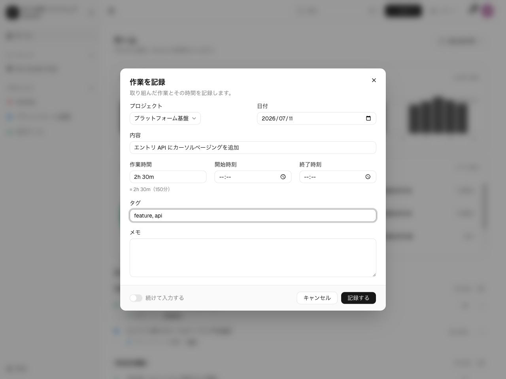

**作業エントリ**は、自分がやったことの記録です。日付・所要時間・短い説明、そして任意の
メモとタグを持ちます。作業エントリはワークスペースの**タイムライン**に新しい順に
表示されます。

## ダッシュボードのタイムライン

サイドバーからワークスペースを開くと、そのダッシュボードが表示されます。上部にサマリー
カードと**期間**セレクタがあり、その下のタイムラインに最近の作業エントリが並びます
（スクロールで一度に50件ずつ追加読み込み）。プロジェクト・メンバー・タグで切り分けたい
ときは、サイドバーからプロジェクトを開きます —
[プロジェクトとタイムライン](/ja/guides/projects-timeline/)を参照してください。

## 作業エントリを作成する

ダッシュボードの **+** ボタンをクリックするか、<kbd>C</kbd> キーを押します（入力欄に
カーソルがないとき）。入力ダイアログが開きます。

次の項目を入力します。

- **日付** — 既定は今日（あなたのタイムゾーン基準）。日付が正しい日に入るよう、
  [タイムゾーン](/ja/guides/account-preferences/)を設定しておきましょう。
- **所要時間** — 分、または時間／分の形式。いずれも有効です: `90`、`90m`、`1.5h`、
  `2h`、`1h30m`。
- **説明** — 何をしたか。
- **プロジェクト**（任意）— プロジェクトに紐付けるか、空のままにしてワークスペース
  全体の作業エントリにします。プロジェクトページからダイアログを開いた場合は、そのプロジェクトが
  あらかじめ選択されます。
- **メモ**（任意）— 自由記述の補足。
- **タグ**（任意）— 後でフィルタやレポートに使えるラベル。

保存すると、作業エントリがタイムラインに追加されます。

### 続けて記録する

ダイアログの**続けて入力する**をオンにすると、開き直さずにまとめて記録できます。オンの
とき、保存すると作業エントリが追加され、**プロジェクト**と**日付**を保持したままダイアログが
開いたままになり、所要時間・説明・メモ・タグは次の入力に向けてクリアされます。この
トグルは作業エントリの作成時のみ表示され、編集時には表示されません。

### プロジェクト紐付き と ワークスペース全体

プロジェクトを指定した作業エントリはそのプロジェクトに属し、指定しない作業エントリはワークスペース
全体の作業エントリになります。どちらもダッシュボードのタイムラインに表示されます。プロジェクト
の指定が変えるのは、作業エントリが他にどこに現れるか、そしてプロジェクトの所属を通じて誰が
見られるか、だけです。

## 作業エントリの編集・削除

タイムラインから、**自分の**作業エントリを編集・削除できます。他のメンバーやエージェントの
作業エントリは読み取り専用です。ワークスペース管理者は全員の作業エントリを読めますが、あなたの代わりに
編集することはありません。

## 他の記録手段

Web UI は同じ API のクライアントの1つです。次の方法でも作業を記録できます。

- [CLI](/ja/guides/tools/cli/): `spantail log "Fixed the build" --project website --duration 1h30m`
- [MCP](/ja/guides/tools/mcp/) 経由で AI クライアントから `log_work` ツールを使う。
