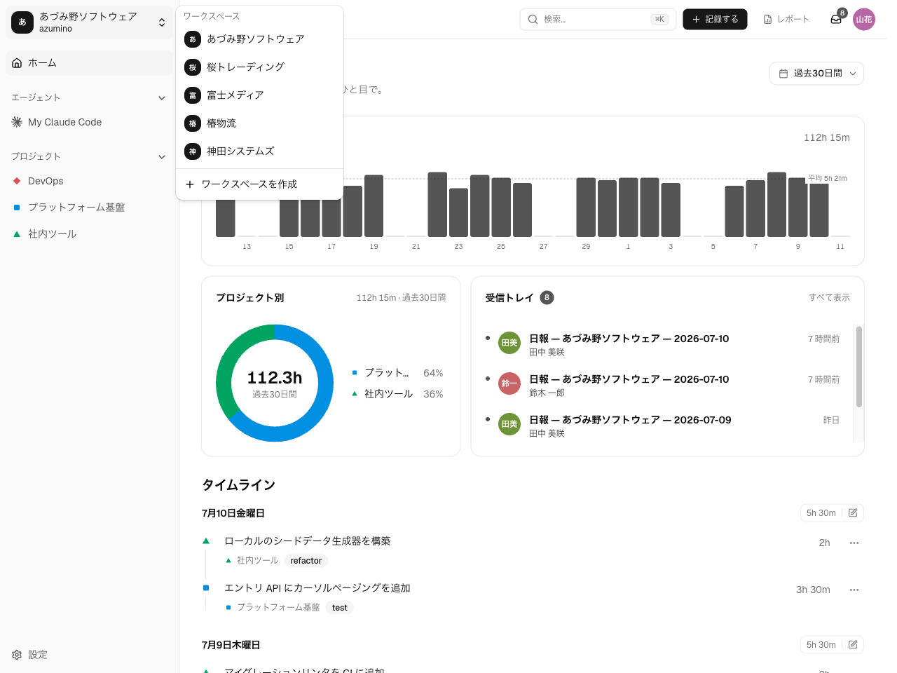
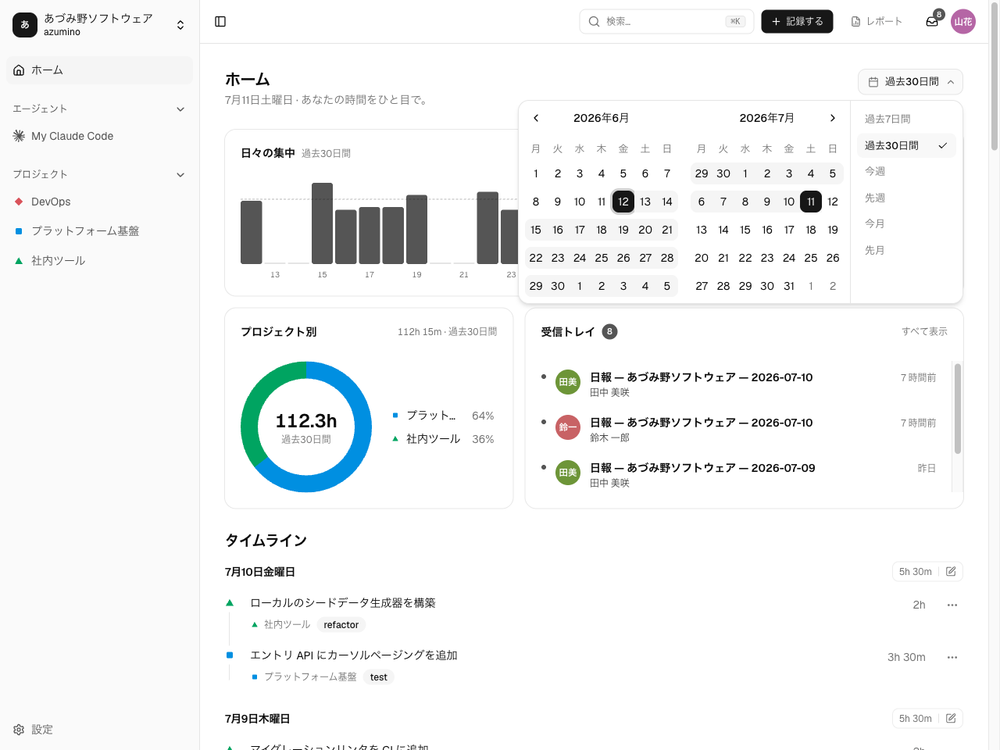
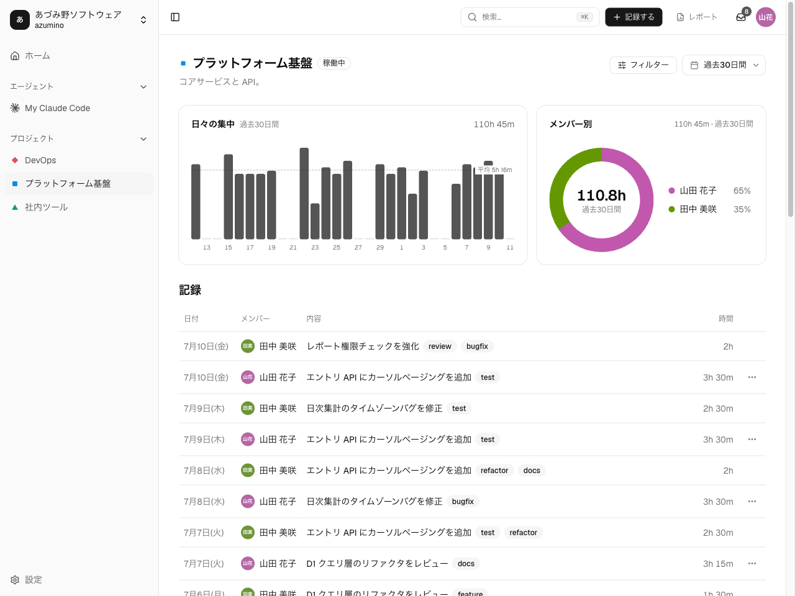

あなたの作業は**ワークスペース**と**プロジェクト**で整理され、作業エントリの**タイムライン**
として表示されます。このページでは、その構造の中をどう移動するかを扱います。

## ワークスペースを切り替える

複数のワークスペースに所属できます。サイドバー上部の**ワークスペース切替**で、操作中の
ワークスペースを変えられます。ナビゲーションとダッシュボードは、その
ワークスペースに合わせて更新されます。

## ダッシュボードのタイムライン

ワークスペースのダッシュボードには、最近の作業エントリを新しい順にタイムラインで表示し、
選択した期間の集計も出します。

- **期間セレクタ** — ダッシュボードが集計する範囲を切り替えます（今週・今月など）。
- **統計** — 選択した期間の合計と、プロジェクト別の内訳。

プロジェクト・メンバー・タグで絞り込むには、プロジェクトページ（下記）を開きます。

## プロジェクトページ

ワークスペースのナビゲーションからプロジェクトを開くと、そのプロジェクトの作業エントリ
だけが、メンバーやタグで絞り込む**フィルター**付きで表示されます。プロジェクトは名前・色・
状態（有効／アーカイブ）を持ち、アーカイブ済みのプロジェクトは選択リストから隠れますが
履歴は残ります。

## 見える範囲

表示はワークスペースとプロジェクトの所属に従います。

- **自分の**作業エントリは常に見えます。
- **プロジェクトメンバー**は、そのプロジェクト内でお互いの作業エントリを見られます。
- **ワークスペース管理者**は、ワークスペース内のすべての作業エントリを読めます。

編集できるのは作成者だけです。作業エントリが見えることと変更できることは別です。役割ごとの
詳細なアクセスモデルは[管理者ガイド](/ja/admin/)を参照してください。

## エージェント活動

エージェントセッションが紐づいた作業エントリは、その詳細パネルにセッションが表示されます。
あるエージェントのセッション・トークン使用量・プロジェクト別の内訳を詳しく見るには、その
活動ページを開きます — [エージェント活動を記録する](/ja/guides/capturing-agents/)を
参照してください。
