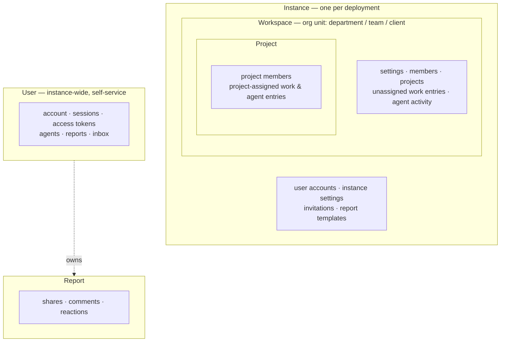
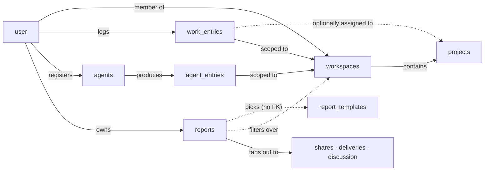
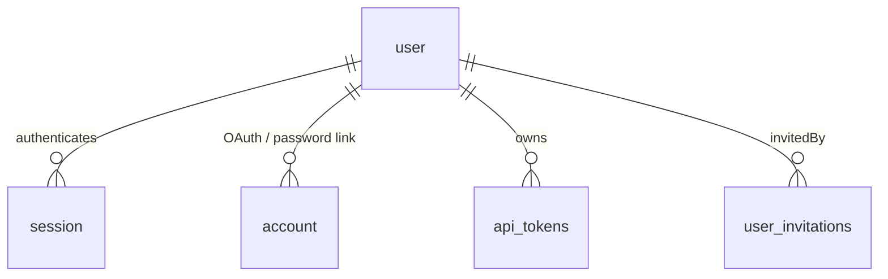
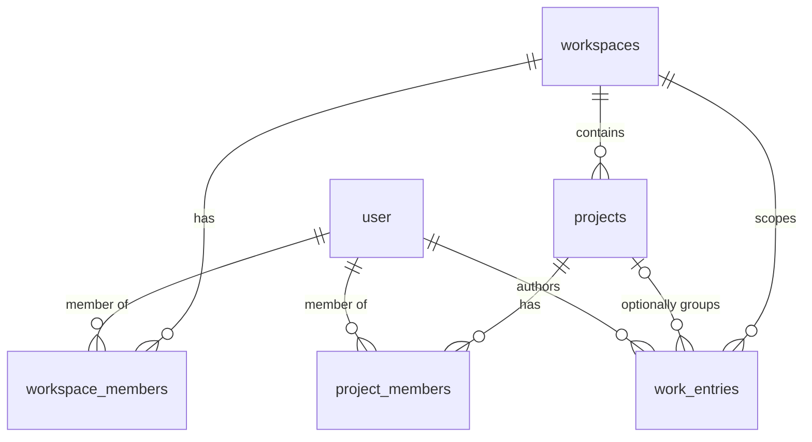
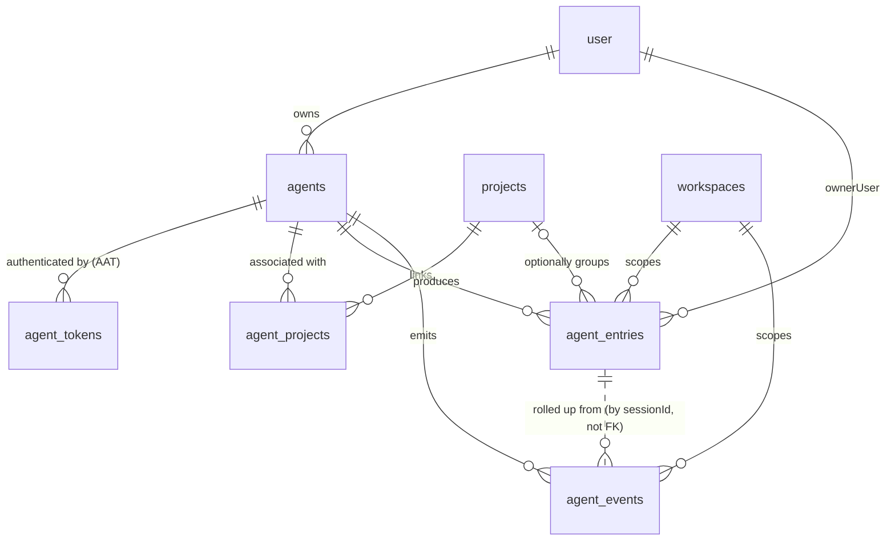
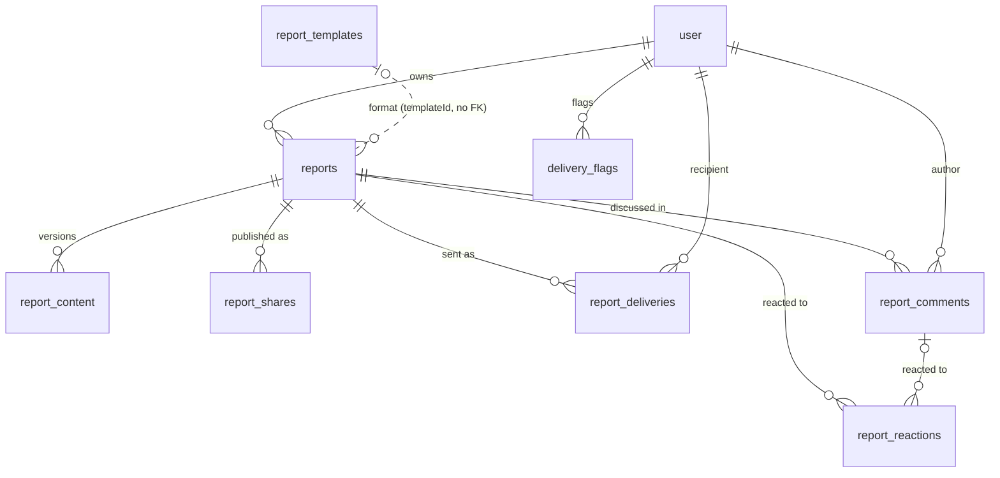
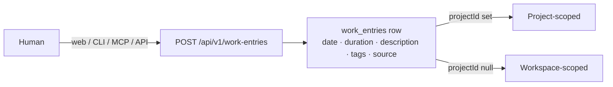
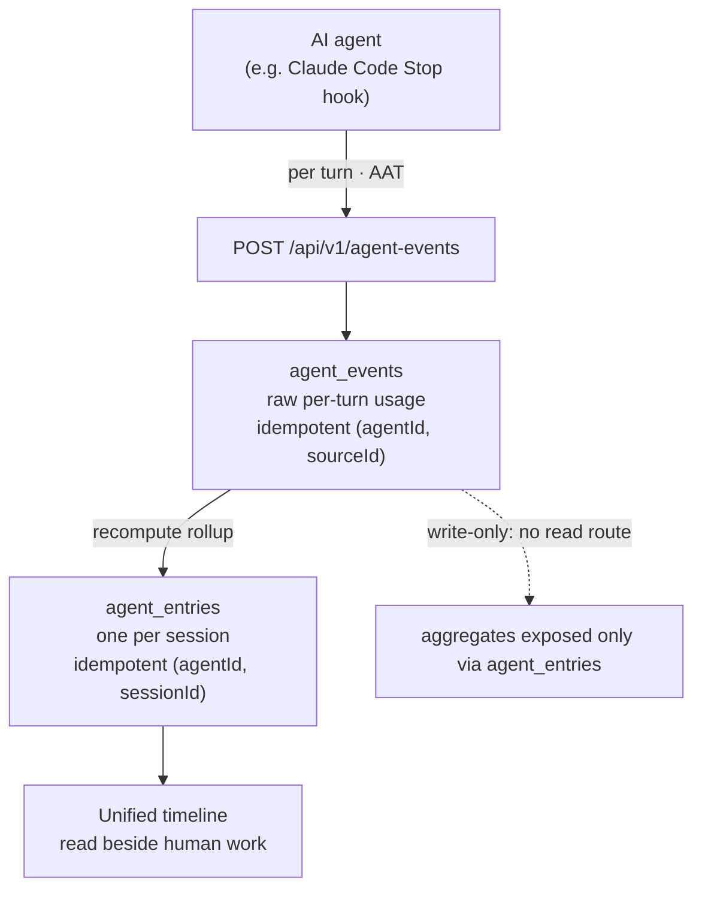
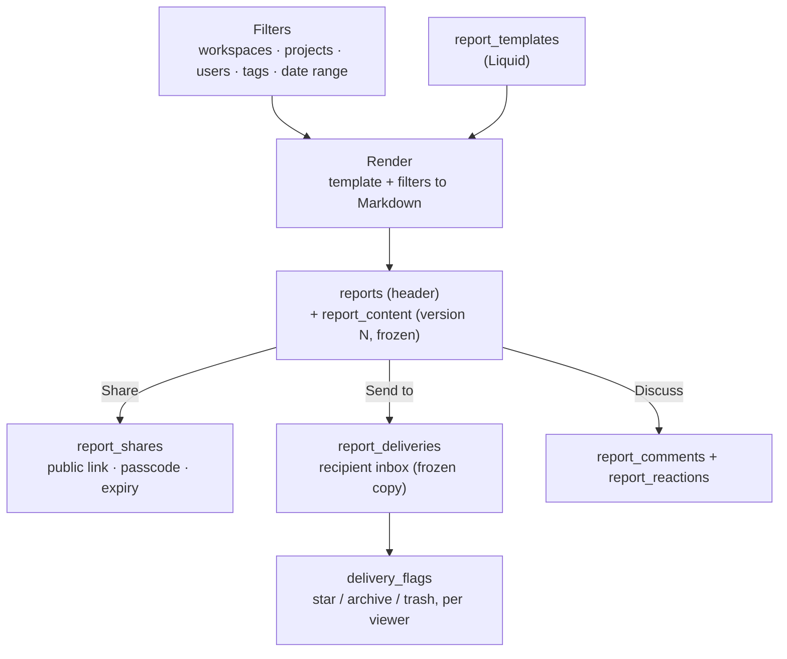

# Data model & resources

This page maps **what entities Spantail stores and how they relate** — the structural
companion to [`permissions.md`](./permissions.md), which covers **who may read and write each
resource**. Read this first to learn the shape of the data; read permissions for the access rules
layered on top.

It is a **map, not a field reference**. The single source of truth for exact columns, types, and
validation stays in code:

- **Database tables** — Drizzle schema in `packages/db/src/schema` (one file per domain).
- **Domain types & request/response shapes** — Zod schemas in `packages/core/src`.

Where this page names a table in prose or catalogs it uses the SQL name (`work_entries`); the
high-level diagrams group resources informally. Where it names a scope or role it matches the
vocabulary in [`permissions.md`](./permissions.md). All timestamps are UTC; see
[Conventions](#conventions) for the date/duration rules.

## Scope hierarchy

Every resource belongs to exactly one **scope**. Scopes nest: an instance contains workspaces, a
workspace contains projects. Users are instance-wide principals that own their personal resources;
a report owns its shares and discussion. Each user account, with its sessions and OAuth links, is
also a single user's own resource. This is the same five-scope model
[`permissions.md`](./permissions.md#scopes) gates access by.

| Scope | Resources that live here |
|---|---|
| **Instance** | `user`, `verification`, `instance_settings`, `user_invitations`, `report_templates` |
| **Workspace** | `workspaces`, `workspace_members`, `projects`, unassigned `work_entries`, workspace-level `agent_entries` / `agent_events` |
| **Project** | `project_members`, `agent_projects`, project-assigned `work_entries` / `agent_entries` |
| **User** | `session`, `account`, `api_tokens`, `agents`, `agent_tokens`, `reports`, `report_content`, inbox (`report_deliveries`, `delivery_flags`), profile |
| **Report** | `report_shares`, `report_comments`, `report_reactions` |

> Two resources are **hybrid-scoped** by a nullable `projectId`: a `work_entries` or `agent_entries`
> row is **project-scoped** when assigned to a project and **workspace-scoped** when not (the state
> left after a project is deleted). See [`permissions.md`](./permissions.md) for what that means for reads.

## Entity map

The spine of the model: a `user` joins `workspaces`, which contain `projects`; humans log
`work_entries` and agents produce `agent_entries` onto the same timeline; `reports` filter over that
data and fan out to shares, deliveries, and discussion.

The four domains below give the precise relationships within each area.

## Domain: Identity & access

Accounts, authentication substrate, personal API credentials, and instance configuration.

Schema: [`packages/db/src/schema/auth.ts`](../packages/db/src/schema/auth.ts), [`tokens.ts`](../packages/db/src/schema/tokens.ts), [`instance.ts`](../packages/db/src/schema/instance.ts) ·
Core types: [`packages/core/src/user.ts`](../packages/core/src/user.ts), [`token.ts`](../packages/core/src/token.ts), [`instance.ts`](../packages/core/src/instance.ts), [`invitation.ts`](../packages/core/src/invitation.ts)

| Entity | Scope | Purpose | Key relationships |
|---|---|---|---|
| `user` | Instance | A person's account. Instance flags: `isAdmin`, `canManageTemplates`, `disabled`. Optional `timezone` (IANA, null → UTC) — the per-user lens for local dates and clock display. | Root of most ownership edges |
| `session` | User | Better Auth login session. | belongs to `user` (cascade) |
| `account` | User | OAuth provider link (google, github) or password credential. | belongs to `user` (cascade) |
| `verification` | Instance | Email-verification and password-reset tokens, keyed by email. No user FK — standalone. | none |
| `api_tokens` | User | Personal access tokens for the REST API; scopes `read` / `write` / `admin`. Hashed; value shown once. | belongs to `user` (cascade) |
| `instance_settings` | Instance | Singleton row (`id = "singleton"`): email, social login, agents toggle. | none |
| `user_invitations` | Instance | Pending email invitations; may grant admin or template-author on accept. | invited by `user` (cascade) |

## Domain: Workspaces & work

The organizational structure and the core human-work unit.

Schema: [`packages/db/src/schema/domain.ts`](../packages/db/src/schema/domain.ts) ·
Core types: [`packages/core/src/workspace.ts`](../packages/core/src/workspace.ts), [`project.ts`](../packages/core/src/project.ts), [`work-entry.ts`](../packages/core/src/work-entry.ts)

| Entity | Scope | Purpose | Key relationships |
|---|---|---|---|
| `workspaces` | Workspace | Organizational unit (department, team, or client) and the primary membership scope — not an isolated tenant (users can belong to several, and reports can span them). Has accent color, optional logo. Timezone is a per-user concept, not a workspace one. | contains projects, members, entries |
| `workspace_members` | Workspace | Membership and role: `owner` / `admin` / `member`. PK (workspaceId, userId). | joins `workspaces` and `user` |
| `projects` | Workspace | A workspace subdivision. Status `active` / `archived`; color hue; slug unique per workspace. | belongs to `workspaces` (cascade) |
| `project_members` | Project | Binary membership (no per-project role), managed by workspace admins. | joins `projects` and `user` |
| `work_entries` | Project / Workspace | Human-logged work: `entry_date`, `durationMinutes`, description, tags, `source`. | author `user`; denormalized `workspaceId`; optional `projectId` (set null on project delete) |

## Domain: Agents & observability

AI coding agents as delegated identities, their ingest credentials, and the activity they stream in.

Schema: [`packages/db/src/schema/agents.ts`](../packages/db/src/schema/agents.ts) ·
Core types: [`packages/core/src/agent.ts`](../packages/core/src/agent.ts), [`agent-events.ts`](../packages/core/src/agent-events.ts)

| Entity | Scope | Purpose | Key relationships |
|---|---|---|---|
| `agents` | User | A registered AI coding agent — a delegated identity of one user, not an independent principal. Type `claude_code` / `codex` / `cursor` / `other`. `disabledAt` (reversible) vs `archivedAt`. | belongs to `user` (cascade) |
| `agent_tokens` | User | Agent Access Token (AAT): a write-only **ingest** credential bound to one agent; optional `defaultWorkspaceId`. Hashed; one active token per agent in practice. | belongs to `agents` (cascade) |
| `agent_projects` | Project | Presentation grouping of an agent to projects — no rows means "all projects". Does **not** gate or default ingest. | joins `agents` and `projects` |
| `agent_entries` | Project / Workspace | One agent **session** rollup: duration and token usage. Idempotent by (agentId, sessionId). Sits on the timeline beside human work. Stores only timestamps (`startedAt`/`endedAt`), no `entry_date` — the calendar day is derived at read time in the viewer's timezone. | `agentId`; owner `user`; denormalized `workspaceId`; optional `projectId` |
| `agent_events` | Workspace | Raw **per-turn** telemetry — one row per assistant message, native usage stored verbatim. Append-only, **write-only (no read route)**. Idempotent by (agentId, sourceId). | `agentId`; denormalized `workspaceId`; tied to a session by `sessionId` (not a FK) |

## Domain: Reports & distribution

A report combines a template with freely chosen filters, renders to an immutable snapshot, and is
distributed by sharing, sending, or discussing.

Schema: [`packages/db/src/schema/reports.ts`](../packages/db/src/schema/reports.ts), [`shares.ts`](../packages/db/src/schema/shares.ts), [`deliveries.ts`](../packages/db/src/schema/deliveries.ts), [`delivery-flags.ts`](../packages/db/src/schema/delivery-flags.ts), [`discussions.ts`](../packages/db/src/schema/discussions.ts) ·
Core types: [`packages/core/src/report.ts`](../packages/core/src/report.ts), [`report-templates.ts`](../packages/core/src/report-templates.ts), [`share.ts`](../packages/core/src/share.ts), [`delivery.ts`](../packages/core/src/delivery.ts), [`discussion.ts`](../packages/core/src/discussion.ts)

| Entity | Scope | Purpose | Key relationships |
|---|---|---|---|
| `report_templates` | Instance | Presentation format (Markdown + Liquid). A fresh instance is seeded with one default template from `@spantail/templates`. | optional author `user` (set null) |
| `reports` | User | Mutable report header: `templateId` + `filters` + note. Scope is a single workspace, or instance scope (every workspace the running user belongs to, resolved to a concrete `filters.workspaceIds` set at render — so an instance-scope report may span multiple workspaces). `version` points at the current snapshot. | owner `user`; `templateId` is a `report_templates` id (no FK) |
| `report_content` | User (per report) | Immutable rendered snapshot per version: YAML front-matter + Markdown body. | belongs to `reports` (cascade) |
| `report_shares` | Report | Public capability link to a frozen snapshot; optional passcode (hashed), expiry, revoke; view counter. | belongs to `reports` (cascade) |
| `report_deliveries` | User (recipient) | "Send to" inbox copy, frozen at send time (email model). One send fans out to N rows grouped by `batchId`. | source `reports` (cascade); sender + recipient `user` |
| `delivery_flags` | User | Per-viewer star / archive / trash on a mailbox item. `scope` is `received` (a delivery id) or `sent` (a batch id) — `targetId` is **not** a FK. | belongs to `user` |
| `report_comments` | Report | Markdown discussion shared by the owner and all Send-to recipients. Author name frozen if the account is deleted. | belongs to `reports`; author `user` (set null) |
| `report_reactions` | Report | Emoji reaction on the report body (`commentId` null) or on a comment (`commentId` set). | belongs to `reports`; optional `report_comments`; `user` |

## Lifecycles

How the entities above come into being and flow through the system.

### Human work logging

A person logs work through any client; all four channels hit the same REST API and produce a
`work_entries` row. Whether it is project- or workspace-scoped depends on `projectId`.

### AI agent telemetry to session entries

A registered agent streams activity using its AAT. Raw per-turn `agent_events` are ingested and the
per-session `agent_entries` rollup is recomputed from them. Events are write-only; only the
aggregated entries are ever read.

### Report generation and distribution

A report renders a template against chosen filters into an immutable, versioned snapshot. From there
it can be shared publicly, sent into inboxes, or discussed — each path copies or attaches to the
frozen content.

## Conventions

Cross-cutting rules that shape many tables. The authoritative statements live in
[`CLAUDE.md`](../CLAUDE.md) (architecture invariants) and [`permissions.md`](./permissions.md);
summarized here for the data model.

- **Dates vs timestamps.** A **date** and a **timestamp** are independent concepts, not derivable
  from each other. `work_entries.entry_date` is a **local date** string `YYYY-MM-DD` in the author's
  timezone, frozen at write time (a manual entry can have a date with no start/end time). Timestamps
  (`startedAt`/`endedAt`, and every other time column) are **UTC** millisecond instants. Durations
  are **integer minutes**. **Timezone is per-user** (`user.timezone`, null → UTC) — there is no
  workspace or project timezone. **Daily aggregation needs no timezone**: it groups by the stored
  `entry_date`, so a user's day is the same for everyone. `agent_entries` are the exception — they
  store **only** timestamps and **no** `entry_date`, so a session that crosses midnight lands on the
  correct day for whoever is viewing; the day is derived from `startedAt` in the viewer's timezone at
  read time. Reports resolve relative ranges (`this_month`) and the generation date in the running
  user's timezone.
- **Denormalized `workspaceId`.** Copied onto `work_entries`, `agent_entries`, and `agent_events` so
  membership-scoped queries never have to join through a project. The workspace is the cheap filter.
- **Archival vs deletion.** `archivedAt` / `status = "archived"` hide a workspace, project, or agent
  while preserving data; `disabledAt` reversibly rejects an agent's token. Deleting a project does
  **not** cascade to its entries — `projectId` is set to null, leaving them as unassigned history.
- **Frozen snapshots.** Shares, deliveries, and report content freeze their rendered Markdown (and
  identifying metadata) at mint/send/render time. A later edit or account deletion never rewrites a
  copy someone already received; the project ACL is captured at render time via `snapshotProjectIds`.
- **Secrets are write-once.** API tokens and agent tokens store only a SHA-256 hash; the plaintext is
  shown once and never returned. Passcodes on shares are KDF-hashed. See
  [`permissions.md`](./permissions.md) for the full secret-handling rules.

## See also

- [`permissions.md`](./permissions.md) — who can read and write each resource (the access model).
- [`security.md`](./security.md) — the security threat model and Spantail-specific security invariants.
- `packages/db/src/schema` — Drizzle tables, the source of truth for columns and indexes.
- `packages/core/src` — Zod schemas, the source of truth for domain types and API shapes.
