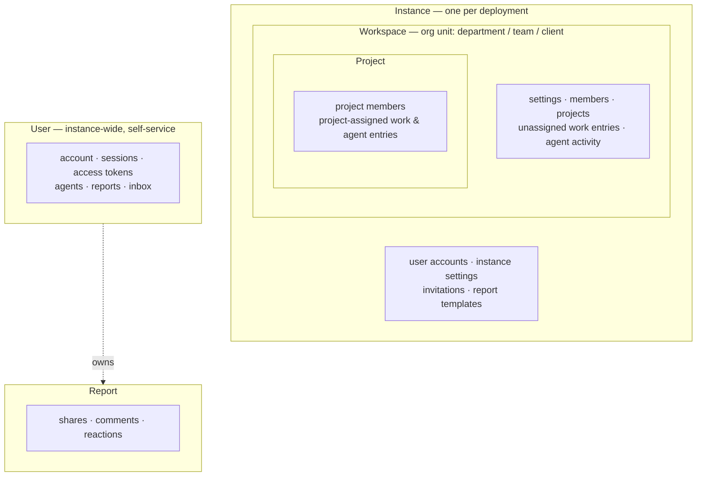
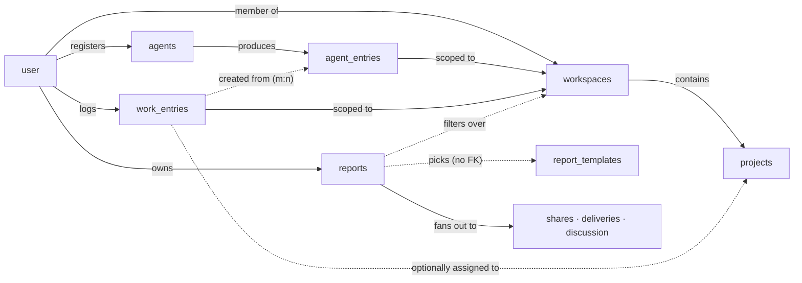
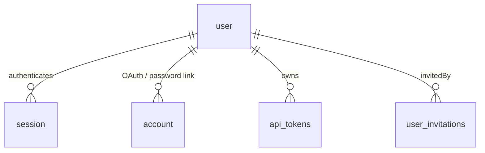
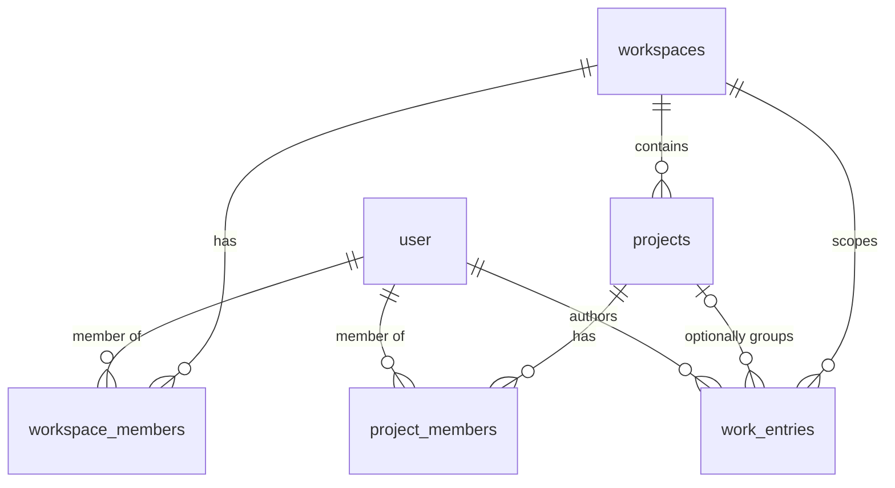
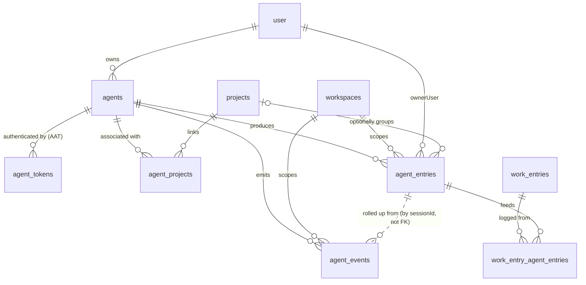
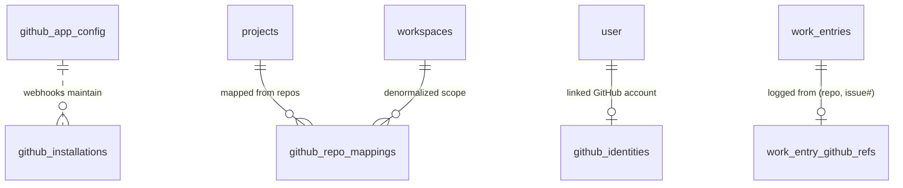
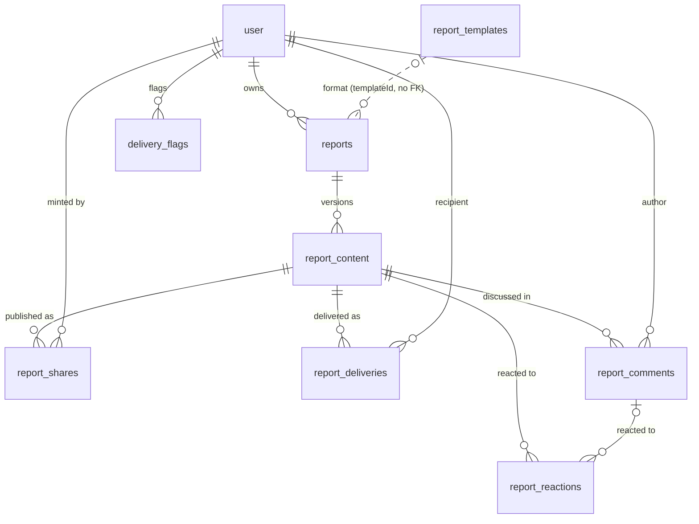
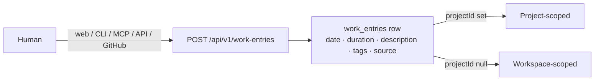
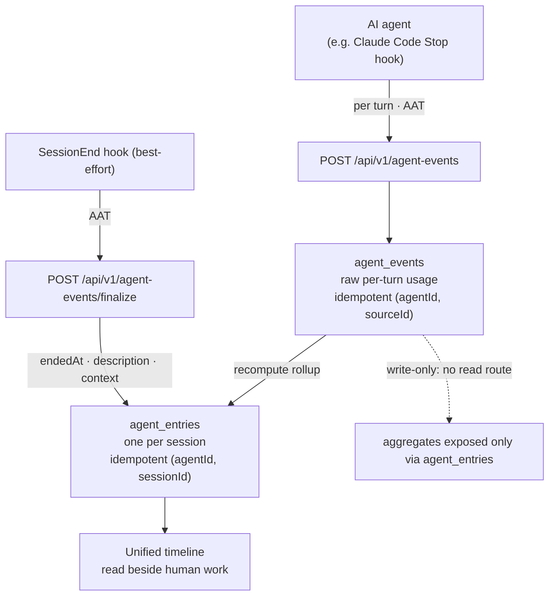
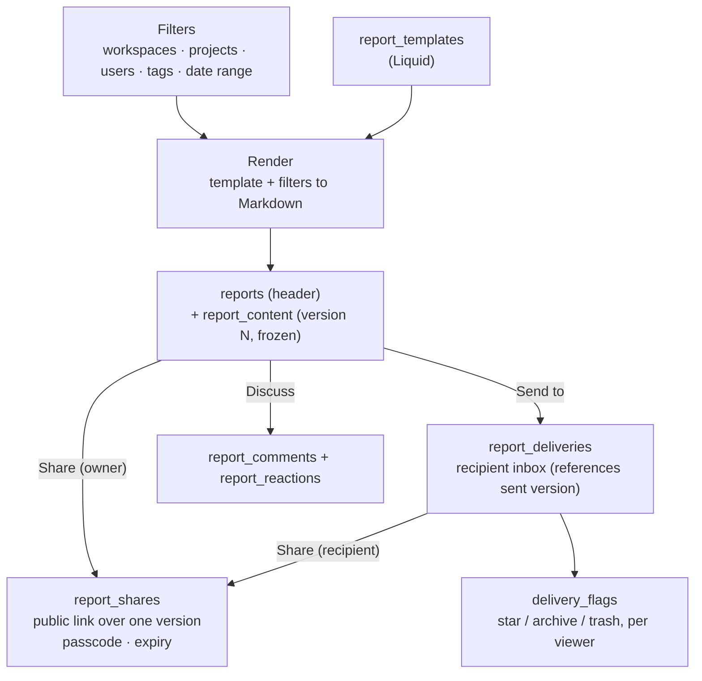

# Data model & resources

This page maps **what entities Spantail stores and how they relate** — the structural
companion to [`permissions.md`](./permissions.md), which covers **who may read and write each
resource**. Read this first to learn the shape of the data; read permissions for the access rules
layered on top.

It is a **map, not a field reference**. The single source of truth for exact columns, types, and
validation stays in code:

- **Database tables** — Drizzle schema in `packages/db/src/schema` (one file per domain).
- **Domain types & request/response shapes** — Zod schemas in `packages/core/src`.

Where this page names a table in prose or catalogs it uses the SQL name (`work_entries`), and
where it names a column it uses that column's Zod field name (`entryDate`) — noting the SQL name
too where the two differ. Enum values and identifiers borrowed from other systems (OTel, Claude
Code transcripts) keep their original spelling. The high-level diagrams group resources
informally. Where this page names a scope or role it matches the vocabulary in
[`permissions.md`](./permissions.md). All timestamps are UTC; see
[Conventions](#conventions) for the date/duration rules.

## Scope hierarchy

The short version: **work data lives in a workspace** — entries, agent activity, and projects all
belong to the workspace where the work happened. The instance level above is administration: user
accounts, invitations, instance settings, and report templates. Alongside, each user owns their
account and credentials. **Reports are the deliberate exception** — the one work-data surface that
can cut across a user's workspaces (their own data, by default) and the unit of sharing.

The precise form of that rule is the five-scope model below, the same one
[`permissions.md`](./permissions.md#scopes) gates access by. Every resource belongs to exactly one
**scope**. Scopes nest: an instance contains workspaces, a workspace contains projects. Users are
instance-wide principals that own their personal resources; a report's immutable content versions
carry its shares and discussion. Each user account, with its sessions and OAuth links, is also a
single user's own resource.

| Scope | Resources that live here |
|---|---|
| **Instance** | `user`, `verification`, `instance_settings`, `user_invitations`, `report_templates`, `github_app_config`, `github_installations` |
| **Workspace** | `workspaces`, `workspace_members`, `projects`, unassigned `work_entries`, workspace-level `agent_entries` / `agent_events`, `github_repo_mappings`, `work_entry_agent_entries` / `work_entry_github_refs` (both follow their parents) |
| **Project** | `project_members`, `agent_projects`, project-assigned `work_entries` / `agent_entries` |
| **User** | `session`, `account`, `api_tokens`, `agents`, `agent_tokens`, `github_identities`, `reports`, `report_content`, inbox (`report_deliveries`, `delivery_flags`), profile |
| **Report** | `report_shares`, `report_comments`, `report_reactions` |

> Two resources are **hybrid-scoped** by a nullable `projectId`: a `work_entries` or `agent_entries`
> row is **project-scoped** when assigned to a project and **workspace-scoped** when not (the state
> left after a project is deleted). See [`permissions.md`](./permissions.md) for what that means for reads.

## Entity map

The spine of the model: a `user` joins `workspaces`, which contain `projects`; humans log
`work_entries` and agents produce `agent_entries` onto the same timeline; `reports` filter over that
data and fan out to shares, deliveries, and discussion.

The five domains below give the precise relationships within each area.

## Domain: Identity & access

Accounts, authentication substrate, personal API credentials, and instance configuration.

Schema: [`packages/db/src/schema/auth.ts`](../packages/db/src/schema/auth.ts), [`tokens.ts`](../packages/db/src/schema/tokens.ts), [`instance.ts`](../packages/db/src/schema/instance.ts) ·
Core types: [`packages/core/src/user.ts`](../packages/core/src/user.ts), [`token.ts`](../packages/core/src/token.ts), [`instance.ts`](../packages/core/src/instance.ts), [`invitation.ts`](../packages/core/src/invitation.ts)

| Entity | Scope | Purpose | Key relationships |
|---|---|---|---|
| `user` | Instance | A person's account. Instance flags: `isAdmin`, `canManageTemplates`, `disabled`. Optional `timezone` (IANA, null → UTC) — the per-user lens for local dates and clock display. | Root of most ownership edges |
| `session` | User | Better Auth login session. | belongs to `user` (cascade) |
| `account` | User | OAuth provider link (google, github) or password credential. | belongs to `user` (cascade) |
| `verification` | Instance | Email-verification and password-reset tokens, keyed by email. No user FK — standalone. | none |
| `api_tokens` | User | Personal access tokens for the REST API; scopes `read` / `write` / `admin`. Hashed; value shown once. | belongs to `user` (cascade) |
| `instance_settings` | Instance | Singleton row (`id = "singleton"`): email, social login, agents and realtime toggles. | none |
| `user_invitations` | Instance | Pending email invitations; may grant admin or template-author on accept. | invited by `user` (cascade) |

## Domain: Workspaces & work

The organizational structure and the core human-work unit.

Schema: [`packages/db/src/schema/domain.ts`](../packages/db/src/schema/domain.ts) ·
Core types: [`packages/core/src/workspace.ts`](../packages/core/src/workspace.ts), [`project.ts`](../packages/core/src/project.ts), [`work-entry.ts`](../packages/core/src/work-entry.ts)

| Entity | Scope | Purpose | Key relationships |
|---|---|---|---|
| `workspaces` | Workspace | Organizational unit (department, team, or client) and the primary membership scope — not an isolated tenant (users can belong to several, and reports can span them). Has accent color, optional logo. Timezone is a per-user concept, not a workspace one. | contains projects, members, entries |
| `workspace_members` | Workspace | Membership and role: `owner` / `admin` / `member`. PK (workspaceId, userId). | joins `workspaces` and `user` |
| `projects` | Workspace | A workspace subdivision. Status `active` / `archived`; marker = color hue + shape symbol (paired so a project is identifiable by shape as well as colour, symbol defaults to `circle`); slug unique per workspace. | belongs to `workspaces` (cascade) |
| `project_members` | Project | Binary membership (no per-project role), managed by workspace admins. | joins `projects` and `user` |
| `work_entries` | Project / Workspace | Human-logged work: `entryDate`, `durationMinutes`, description, tags, `source`. | author `user`; denormalized `workspaceId`; optional `projectId` (set null on project delete) |

## Domain: Agents & observability

AI coding agents as delegated identities, their ingest credentials, and the activity they stream in.

Schema: [`packages/db/src/schema/agents.ts`](../packages/db/src/schema/agents.ts) ·
Core types: [`packages/core/src/agent.ts`](../packages/core/src/agent.ts), [`agent-events.ts`](../packages/core/src/agent-events.ts)

| Entity | Scope | Purpose | Key relationships |
|---|---|---|---|
| `agents` | User | A registered AI coding agent — a delegated identity of one user, not an independent principal. Type `claude_code` (v1 targets Claude Code only). `disabledAt` (reversible) vs `archivedAt`. | belongs to `user` (cascade) |
| `agent_tokens` | User | Agent Access Token (AAT): a write-only **ingest** credential bound to one agent; optional `defaultWorkspaceId`. Hashed; one active token per agent in practice. | belongs to `agents` (cascade) |
| `agent_projects` | Project | Presentation grouping of an agent to projects — no rows means "all projects". Does **not** gate or default ingest. | joins `agents` and `projects` |
| `agent_entries` | Project / Workspace | One agent **session** rollup: duration, token usage (plus summed `costUsd` when events carry one), `context` — distinct non-usage facets (`models`, `branches`, `repositories`, client-supplied `refs`) — and `eventCount` (SQL `rollup_event_count`), the number of events the rollup was computed from (null on summary-path sessions, which carry no events). Idempotent by (agentId, sessionId). Sits on the timeline beside human work. Stores only timestamps (`startedAt`/`endedAt`), no `entryDate` — the calendar day is derived at read time in the viewer's timezone. | `agentId`; owner `user`; denormalized `workspaceId`; optional `projectId` |
| `agent_events` | Workspace | Raw **per-turn** telemetry — one row per assistant message: `operation` (what the turn is, `chat` by default), native usage stored verbatim, optional client-provided `costUsd`, and `attributes` (bounded key/value metadata, OTel attribute names where one exists — see the mapping below). Append-only, **write-only (no read route)**. Idempotent by (agentId, sourceId). | `agentId`; denormalized `workspaceId`; tied to a session by `sessionId` (not a FK) |
| `work_entry_agent_entries` | Workspace (via parents) | Provenance link (m:n): which agent sessions a human work entry was logged from. Written when a work entry is created from selected sessions; read back by `GET /api/v1/work-entries/:id/agent-entries` (the entry dialog's session summary), ACL-filtered so a link never widens visibility. PK (workEntryId, agentEntryId). | joins `work_entries` and `agent_entries` (cascade on both sides) |

### OTel GenAI mapping

Agent telemetry follows the [OTel GenAI semantic conventions](https://github.com/open-telemetry/semantic-conventions-genai)
loosely — the conventions are still in Development status, so Spantail borrows the concepts and
attribute names without hard-coding their enums. The correspondence:

| Spantail | OTel semconv | Notes |
|---|---|---|
| one `agent_events` row | a span | Point-in-time (`timestamp` only); no trace/parent ids |
| `agent_events.operation` | `gen_ai.operation.name` | Free-form; `chat` = one inference turn |
| `agent_events.sessionId` / `agent_entries.sessionId` | `gen_ai.conversation.id` | A real client identifier (Claude Code's `session_id`), never a synthesized one |
| `agents.type` | `gen_ai.provider.name` | e.g. `claude_code` → `anthropic` |
| `agent_events.model` / `usage.model` | `gen_ai.request.model` / `gen_ai.response.model` | One field; the response model when the source reports it |
| `usage.inputTokens` | (part of `gen_ai.usage.input_tokens`) | Spantail keeps the provider's **disjoint** buckets and `totalTokens` = sum of all four; OTel's `input_tokens` *includes* the cache buckets — convert with `input_tokens = inputTokens + cacheCreationTokens + cacheReadTokens` |
| `usage.cacheCreationTokens` / `cacheReadTokens` | `gen_ai.usage.cache_creation.input_tokens` / `gen_ai.usage.cache_read.input_tokens` | Same values; only the containment semantics differ (see above) |
| `usage.outputTokens` | `gen_ai.usage.output_tokens` | |

Recommended `agent_events.attributes` keys (stored verbatim and read defensively — the server
validates bounds, not names):

| Key | Source (Claude Code) | Origin |
|---|---|---|
| `vcs.ref.head.name` | transcript `gitBranch` | OTel semconv (VCS) |
| `vcs.repository.url.full` | hook: `git remote get-url origin` | OTel semconv (VCS) |
| `process.working_directory` | hook input / transcript `cwd` | OTel semconv |
| `app.version` | transcript `version` | same name as Claude Code's own telemetry |
| `request.id` | transcript `requestId` | Spantail-specific (traceability) |

Transcript content and source code are never ingested — only usage and the bounded metadata
above (the OTel content-capture guidance and [`security.md`](./security.md) §2 both demand this).

## Domain: GitHub integration

The bring-your-own GitHub App (each instance registers its own via the App Manifest flow) and
the server-side state that turns `@spantail` comments and `#N` log-work calls into work entries.

Schema: [`packages/db/src/schema/github.ts`](../packages/db/src/schema/github.ts) ·
Core types: [`packages/core/src/github/api.ts`](../packages/core/src/github/api.ts)

| Entity | Scope | Purpose | Key relationships |
|---|---|---|---|
| `github_app_config` | Instance | The BYO App's credentials, one row (`id = "singleton"`); its existence is the "enabled" flag. Secrets (private key as PKCS#8 DER, webhook secret, OAuth client secret) are AES-GCM encrypted at rest (see [`security.md`](./security.md) §9); `clientId` is public. | standalone |
| `github_installations` | Instance | Where the App is installed (account login/type, suspended state). Maintained solely by `installation` webhooks; installed repos are **not mirrored** — the settings UI lists them live from the GitHub API. | keyed by GitHub's `installationId` |
| `github_repo_mappings` | Workspace | repo → project: the single source of truth for project resolution (clients hold no project id). Keyed by the lowercased `repoFullName` (unique instance-wide); the numeric `repoId` (present for installation-sourced rows) self-heals the cached name across renames. Survives App/installation removal — that is degraded mode. | `projects` / `workspaces` (cascade) |
| `github_identities` | User | GitHub account ↔ Spantail user, 1:1 both ways, keyed by the immutable numeric GitHub user id (login is a display cache). Established via the App's user-authorization OAuth flow, so ownership is verified. Attribution-only — never a sign-in method. | `user` (cascade) |
| `work_entry_github_refs` | Workspace (via parent) | (repo, issue#) provenance of a GitHub-logged entry; backs the "total on this issue" running sum and, via the unique `commentId`, webhook redelivery idempotency (`commentId` is null for plugin-logged entries). | `work_entries` (cascade, PK) |

Agent sessions are linked at log time through the existing `work_entry_agent_entries` rows: a
snapshot taken when the entry is created (candidates matched by `context.repositories` +
refs/branch heuristics), never revisited for late-arriving sessions.

## Domain: Reports & distribution

A report combines a template with freely chosen filters, renders to an immutable snapshot, and is
distributed by sharing, sending, or discussing.

Schema: [`packages/db/src/schema/reports.ts`](../packages/db/src/schema/reports.ts), [`shares.ts`](../packages/db/src/schema/shares.ts), [`deliveries.ts`](../packages/db/src/schema/deliveries.ts), [`delivery-flags.ts`](../packages/db/src/schema/delivery-flags.ts), [`discussions.ts`](../packages/db/src/schema/discussions.ts) ·
Core types: [`packages/core/src/report.ts`](../packages/core/src/report.ts) (reports and templates), [`share.ts`](../packages/core/src/share.ts), [`delivery.ts`](../packages/core/src/delivery.ts), [`discussion.ts`](../packages/core/src/discussion.ts)

| Entity | Scope | Purpose | Key relationships |
|---|---|---|---|
| `report_templates` | Instance | Presentation format (Markdown + Liquid). A fresh instance is seeded with one default template from `@spantail/templates`. Exactly one row is the instance default (`isDefault`) — the compose fallback; it cannot be deleted or disabled. `nameTemplate` / `noteTemplate` are optional Liquid that produce a new report's initial name/note at compose time (rendered with a scope-only context: `user`, `workspaces`, `projects`, `users`, `period`). `defaultDateRange` is an optional `DateRangePreset` (`today`, `yesterday`, `last_7_days`, `last_30_days`, `this_week`, `last_week`, `this_month`, `last_month`) seeding the compose dialog's initial date range; null falls back to `today`. | optional author `user` (set null) |
| `reports` | User | Mutable report header: `templateId` + `filters` + note. Scope is a single workspace (`filters.workspaceIds === [id]`), or instance scope (`filters.workspaceIds === []`). Instance scope is owner-scoped and spans every workspace the running user belongs to, resolved to a concrete membership set only transiently to bound the entry query at render — that resolved set is **not** persisted, so the stored filter keeps the empty set (a legacy report may still hold a resolved multi-workspace set). Entries are scoped to the owner's **own** work by default: when `filters.userIds` is empty the render restricts to the owner (so the web app, which never sets `userIds`, always produces an own-only report — even an instance-scope one, even for an instance admin); the API can pass explicit `userIds` for a cross-user report, still bounded by the owner's entry access. `version` points at the current snapshot. `snapshotWorkspaceIds` freezes the workspace set the current snapshot was rendered against (alongside `snapshotProjectIds`): every membership gate on the report — owner read/edit, list redaction, the Send-to / share ACL, and the recipient pool — is bounded by this frozen scope, not the empty stored filter or live memberships, so access stays stable and cross-user snapshots are never left ungated (null on legacy rows falls back to `filters.workspaceIds`). | owner `user`; `templateId` is a `report_templates` id (no FK) |
| `report_content` | User (per report) | Immutable rendered snapshot per version: YAML front-matter + Markdown body. | belongs to `reports` (cascade) |
| `report_shares` | Content version | Public capability link over one immutable `report_content` version (no copied body — the referenced version can never change). Minted by the report owner (report screen) or a delivery recipient (Messages); `createdByUserId` is the sole ownership anchor and listings scope by (content, creator). Optional passcode (hashed), expiry, revoke; view counter. | belongs to `report_content` (cascade); creator `user` (cascade) |
| `report_deliveries` | User (recipient) | "Send to" inbox message referencing the exact immutable `report_content` version sent (email model: a later edit appends a new version and never changes what was received). One send fans out to N rows grouped by `batchId`. Title/period/body derive from the version (its front matter) at read time; legacy pre-front-matter versions fall back to the live report header. Only the sender identity (`senderName`/`senderEmail`) is frozen as columns. Deleting the report removes its deliveries through the content-version cascade. | sent version `report_content` (cascade); sender `user` (set null) + recipient `user` (cascade) |
| `delivery_flags` | User | Per-viewer star / archive / trash on a mailbox item. `scope` is `received` (a delivery id) or `sent` (a batch id) — `targetId` is **not** a FK. | belongs to `user` |
| `report_comments` | Content version | Markdown discussion on one sent `report_content` version, shared by the report owner and that version's Send-to recipients — a later edit's version starts a fresh thread. Author name frozen if the account is deleted. | belongs to `report_content` (cascade); author `user` (set null) |
| `report_reactions` | Content version | Emoji reaction on the version's body (`commentId` null) or on a comment (`commentId` set). | belongs to `report_content` (cascade); optional `report_comments`; `user` |

## Lifecycles

How the entities above come into being and flow through the system.

### Human work logging

A person logs work through any client; all five channels hit the same REST API and produce a
`work_entries` row, which records the channel in `source`. Whether it is project- or
workspace-scoped depends on `projectId`.

### AI agent telemetry to session entries

A registered agent streams activity using its AAT. Raw per-turn `agent_events` are ingested and the
per-session `agent_entries` rollup is recomputed from them — on **every** ingest, so the entry is
always current even if the session never ends cleanly. A best-effort finalize (e.g. Claude Code's
SessionEnd hook) can then supplement the entry with closing facts (wall-clock end, description,
extra context) without touching the events-derived usage rollup. Events are write-only; only the
aggregated entries are ever read.

### Report generation and distribution

A report renders a template against chosen filters into an immutable, versioned snapshot. From there
it can be shared publicly, sent into inboxes, or discussed — each path copies or attaches to the
frozen content.

## Conventions

Cross-cutting rules that shape many tables. The authoritative statements live in
[`conventions.md`](./conventions.md) (architecture invariants) and [`permissions.md`](./permissions.md);
summarized here for the data model.

- **Dates vs timestamps.** A **date** and a **timestamp** are independent concepts, not derivable
  from each other. `work_entries.entryDate` is a **local date** string `YYYY-MM-DD` in the author's
  timezone, frozen at write time (a manual entry can have a date with no start/end time). Timestamps
  (`startedAt`/`endedAt`, and every other time column) are **UTC** millisecond instants. Durations
  are **integer minutes**. **Timezone is per-user** (`user.timezone`, null → UTC) — there is no
  workspace or project timezone. **Daily aggregation needs no timezone**: it groups by the stored
  `entryDate`, so a user's day is the same for everyone. `agent_entries` are the exception — they
  store **only** timestamps and **no** `entryDate`, so a session that crosses midnight lands on the
  correct day for whoever is viewing; the day is derived from `startedAt` in the viewer's timezone at
  read time. Reports resolve relative ranges (`this_month`) and the generation date in the running
  user's timezone.
- **Denormalized `workspaceId`.** Copied onto `work_entries`, `agent_entries`, and `agent_events` so
  membership-scoped queries never have to join through a project. The workspace is the cheap filter.
- **Archival vs deletion.** `archivedAt` / `status = "archived"` hide a workspace, project, or agent
  while preserving data; `disabledAt` reversibly rejects an agent's token. An **archived workspace**
  is additionally **read-only**: every write into it (entries, agent ingest, projects, members,
  settings) is rejected with 409 until it is unarchived — only unarchiving and deleting the
  workspace itself stay allowed — and it is hidden from the workspace switcher while remaining
  readable. Deleting a project does **not** cascade to its entries — `projectId` is set to null,
  leaving them as unassigned history. Deleting a **workspace** does cascade: members, projects,
  work entries, agent entries/events, and agent tokens bound to the workspace are all removed.
  Report snapshots survive (they are user-scoped), but the deleted workspace drops out of scope
  validation, the same as losing membership.
- **Frozen snapshots.** Deliveries freeze their rendered Markdown (and identifying metadata) at
  send time; shares reference an immutable `report_content` version instead of copying it — same
  guarantee, by construction. A later edit or account deletion never rewrites what someone already
  received or published; the project ACL is captured at render time via `snapshotProjectIds`.
- **Secrets are write-once.** API tokens and agent tokens store only a SHA-256 hash; the plaintext is
  shown once and never returned. Passcodes on shares are KDF-hashed. See
  [`permissions.md`](./permissions.md) for the full secret-handling rules.

## See also

- [`permissions.md`](./permissions.md) — who can read and write each resource (the access model).
- [`security.md`](./security.md) — the security threat model and Spantail-specific security invariants.
- `packages/db/src/schema` — Drizzle tables, the source of truth for columns and indexes.
- `packages/core/src` — Zod schemas, the source of truth for domain types and API shapes.
